# Connected Mobility Solution on AWS

**[Connected Mobility Solution on AWS](https://aws.amazon.com/solutions/implementations/connected-mobility-solution-on-aws/)** | **[🚧 Feature request](https://github.com/aws-solutions/connected-mobility-solution-on-aws/issues/new?assignees=&labels=enhancement&template=feature_request.md&title=)** | **[🐛 Bug Report](https://github.com/aws-solutions/connected-mobility-solution-on-aws/issues/new?assignees=&labels=bug&template=bug_report.md&title=)** | **[❓ General Question](https://github.com/aws-solutions/connected-mobility-solution-on-aws/issues/new?assignees=&labels=question&template=general_question.md&title=)**

**Note**: If you want to use the solution without building from source,
navigate to the [AWS Solution Page](https://aws.amazon.com/solutions/implementations/connected-mobility-solution-on-aws/).

**If you want to jump straight into building and deploying, [click here](#deployment-prerequisites)**

## Table of Contents
- [Connected Mobility Solution on AWS](#connected-mobility-solution-on-aws)
  - [Table of Contents](#table-of-contents)
  - [Solution Overview](#solution-overview)
  - [Architecture Diagrams](#architecture-diagrams)
    - [Solution Architecture Diagram](#solution-architecture-diagram)
    - [ACDP Architecture Diagram](#acdp-architecture-diagram)
    - [CMS Backstage Architecture Diagram](#cms-backstage-architecture-diagram)
    - [ACDP Deployment Sequence Diagram](#acdp-deployment-sequence-diagram)
    - [Module Deployment Sequence Diagram](#module-deployment-sequence-diagram)
  - [CMS Modules](#cms-modules)
    - [Environment](#environment)
  - [Deployment Setup/Pre-requisites](#deployment-setuppre-requisites)
    - [Pre-requisite tools](#pre-requisite-tools)
    - [Required Tool Versions](#required-tool-versions)
    - [Clone the Repository](#clone-the-repository)
    - [Install Pre-requisite Tools (OSX/Linux)](#install-pre-requisite-tools-osxlinux)
      - [NVM](#nvm)
      - [Node / NPM](#node--npm)
      - [Yarn](#yarn)
      - [Pyenv](#pyenv)
      - [Python / Pip](#python--pip)
      - [Pipenv](#pipenv)
      - [AWS CLI](#aws-cli)
      - [AWS CDK Toolkit](#aws-cdk-toolkit)
      - [Verify Required Tool Installations](#verify-required-tool-installations)
    - [Install Solution Dependencies](#install-solution-dependencies)
    - [Create a Route53 Hosted Zone](#create-a-route53-hosted-zone)
    - [Setup environment variables](#setup-environment-variables)
      - [Create a *.env* file (preferred method)](#create-a-env-file-preferred-method)
      - [Set environment variables (secondary option)](#set-environment-variables-secondary-option)
      - [Verify environment variable setup (cdk-context)](#verify-environment-variable-setup-cdk-context)
  - [Deploy](#deploy)
    - [Deployment Pre-Requisites](#deployment-pre-requisites)
    - [Run CDK Bootstrap](#run-cdk-bootstrap)
    - [Upload S3 Deployment Assets](#upload-s3-deployment-assets)
    - [Deploy the Automotive Cloud Developer Portal (ACDP)](#deploy-the-automotive-cloud-developer-portal-acdp)
    - [Monitoring the ACDP Deployment](#monitoring-the-acdp-deployment)
    - [Bootstrap Proton](#bootstrap-proton)
    - [Deploy CMS Modules via Backstage](#deploy-cms-modules-via-backstage)
      - [CMS Module Deployment Order](#cms-module-deployment-order)
        - [Deployment Order of Modules with Dependencies](#deployment-order-of-modules-with-dependencies)
        - [Modules Without Dependencies](#modules-without-dependencies)
      - [Example Module Deployment via Backstage](#example-module-deployment-via-backstage)
  - [Cost scaling](#cost-scaling)
  - [Collection of Operational Metrics](#collection-of-operational-metrics)
  - [Teardown](#teardown)
  - [Developer Guide](#developer-guide)
    - [Logging](#logging)
      - [Lambda functions](#lambda-functions)
      - [Backstage logs](#backstage-logs)
    - [Pre-Commit Hooks](#pre-commit-hooks)
    - [Unit Test](#unit-test)
  - [License](#license)

## Solution Overview

The Connected Mobility Solution (CMS) on AWS provides the automotive
industry customers the capability to communicate between vehicles and the
AWS Cloud, manage and orchestrate CMS on AWS deployments from a centralized
developer platform, securely authenticate and authorize users and services
onboard vehicles into AWS IoT Core, create vehicle profiles for storing data
about registered vehicles and capture and store telemetry data emitted from
registered vehicles. Additionally it provides capabilities to query stored
vehicle data, create alerts and subscribe to notifications based on data thresholds,
visualize vehicle telemetry data through a provided dashboard and simulate
connected vehicle data.

For more information and a detailed deployment guide, visit the
[Connected Mobility Solution on AWS](https://aws.amazon.com/solutions/implementations/connected-mobility-solution-on-aws/)
solution page.

## Architecture Diagrams

### Solution Architecture Diagram


### ACDP Architecture Diagram

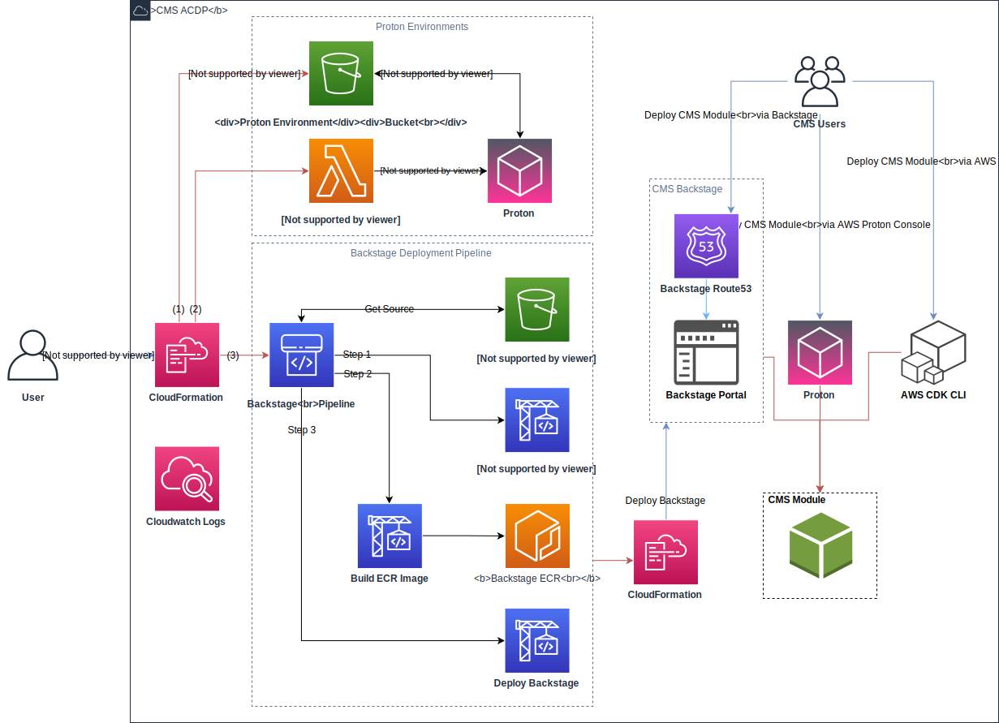

### CMS Backstage Architecture Diagram


### ACDP Deployment Sequence Diagram

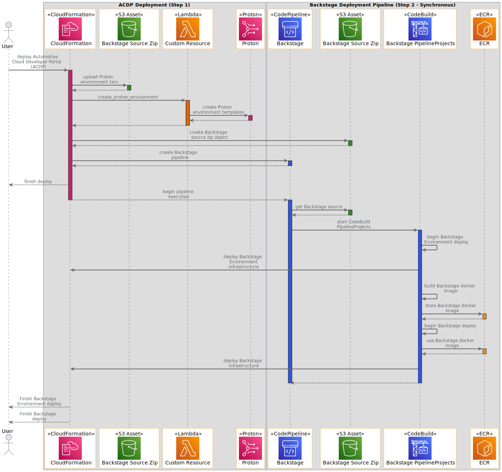

### Module Deployment Sequence Diagram

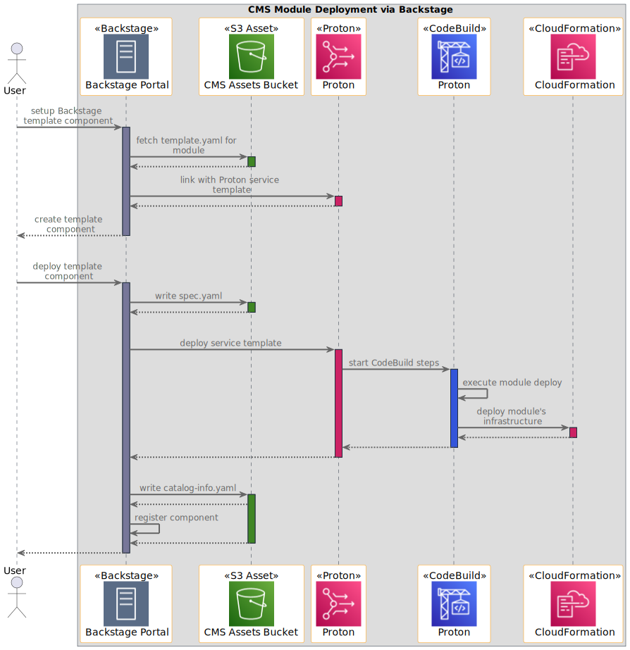

## CMS Modules

For detailed information visit the module's README

- [Alerts](./templates/modules/cms_alerts_on_aws/v1/instance_infrastructure/README.md)
- [API](./templates/modules/cms_api_on_aws/v1/instance_infrastructure/README.md)
- [Connect & Store](./templates/modules/cms_connect_store_on_aws/v1/instance_infrastructure/README.md)
- [EV Battery Health](./templates/modules/cms_ev_battery_health_on_aws/v1/instance_infrastructure/README.md)
- [Provisioning](./templates/modules/cms_provisioning_on_aws/v1/instance_infrastructure/README.md)
- [Authentication](./templates/modules/cms_user_authentication_on_aws/v1/instance_infrastructure/README.md)
- [Vehicle Simulator](./templates/modules/cms_vehicle_simulator_on_aws/v1/instance_infrastructure/README.md)

### Environment

For reference, there is a proton environment setup with further
details in its [README](./templates/environments/cms_environment/v1/infrastructure/README.md).

## Deployment Setup/Pre-requisites

### Pre-requisite tools

To deploy CMS on AWS, a variety of tools are required. These deploy instructions will install the following to your machine:

- [NVM](https://github.com/nvm-sh/nvm)
- [Node](https://nodejs.org/en)
- [NPM](https://www.npmjs.com/)
- [Yarn](https://yarnpkg.com/)
- [Pyenv](https://github.com/pyenv/pyenv)
- [Python](https://www.python.org/)
- [Pip](https://pypi.org/project/pip/)
- [Pipenv](https://pipenv.pypa.io/en/latest/installation.html)
- [AWS CLI](https://docs.aws.amazon.com/cli/)
- [AWS CDK Toolkit](https://docs.aws.amazon.com/cdk/v2/guide/cli.html)

### Required Tool Versions

Certain tools also require specific versions. See the table below for the appropriate versions. Following the
provided install instructions will install the correct versions.

For tools not listed here, stable versions should work appropriately.

| Dependency | Version  |
|------------|----------|
| [NodeJS](https://docs.npmjs.com/downloading-and-installing-node-js-and-npm)   | 18.17.1    |
| [NPM](https://docs.npmjs.com/downloading-and-installing-node-js-and-npm)      | 9.6.7      |
| [Python](https://www.python.org)                                              | 3.10.9     |

### Clone the Repository

If you have not done so, first clone the repository, and then `cd` into the created directory. If you have
already cloned the repository, ensure you still `cd` into the solution's directory.

```bash
git clone https://github.com/aws-solutions/connected-mobility-solution-on-aws.git
cd connected-mobility-solution-on-aws
```

> **WARNING:** If you do not `cd` into the repository before following these instructions, the correct versions may not be installed.

### Install Pre-requisite Tools (OSX/Linux)

Install the following tools in the order instructed here. Where appropriate, a script has been provided to aid in install.
Otherwise, please visit the installation guide provided by the tool's publisher to ensure a correct installation.

> **WARNING:** If after a successful installation, a command is not found, you may need to restart your terminal.

#### NVM

Follow the [nvm installation guide](https://github.com/nvm-sh/nvm#installing-and-updating) to install NVM.
Ensure your installation properly set your path by running the script below.

```bash
nvm --version
# Expected Output: x.xx.x
```

#### Node / NPM

```bash
nvm install
nvm use
```

For more information see the [nvm usage guide](https://github.com/nvm-sh/nvm#usage) for installing the correct
version of Node. Manually installing Node without the use of nvm is not recommended.

#### Yarn

Follow the [yarn installation guide](https://classic.yarnpkg.com/lang/en/docs/install/#mac-stable). Ensure your
installation properly set your path by running the script below.

```bash
yarn --version
# Expected Output: x.xx.xx
```

#### Pyenv

Follow the [pyenv installation guide](https://github.com/pyenv/pyenv#automatic-installer) to install Pyenv.
You will likely need to manually add Pyenv to your PATH by following the provided instructions. Ensure your
installation properly set your path by running the script below.

```bash
pyenv --version
# Expected Output: pyenv x.x.xx
```

#### Python / Pip

```bash
pyenv install -s
```

For more information see the [pyenv usage guide](https://github.com/pyenv/pyenv#usage) for installing the
correct version of Python. Manually installing Python without the use of pyenv is not recommended.

#### Pipenv

Follow the [pipenv installation guide](https://pipenv.pypa.io/en/latest/installation.html) to install Pipenv.
You will likely need to manually add Pipenv to your PATH by following the provided instructions. Ensure your
installation properly set your PATH by running the script below.

```bash
pipenv --version
# Expected Output: pipenv, version xxxx.xx.x
```

#### AWS CLI

Follow the installation instructions laid out in the
[AWS CLI install page](https://docs.aws.amazon.com/cli/latest/userguide/getting-started-install.html).
This install is OS specific, and includes multiple options for both a system wide, and user specific
install. Follow the install instructions most appropriate to you. Ensure your installation properly
set your PATH by running the script below.

```bash
aws --version
# Expected Output: aws-cli/x.xx.xx ...
```

#### AWS CDK Toolkit

Follow the [installation guide](https://docs.aws.amazon.com/cdk/v2/guide/cli.html) to install the
AWS CDK toolkit. Ensure your installation properly set your PATH by running the script below.

```bash
cdk --version
# Expected Output: x.xxx.x (build ...)
```

#### Verify Required Tool Installations

Run the following command to verify the proper installation of all of the tools listed above. If
any errors are displayed, attempt to reinstall that tool.

```bash
make verify-required-tools
```

### Install Solution Dependencies

Now that you have the correct tools, you can install the dependencies used by the solution using `make install`.
After installing, we will activate the environment which contains the dependencies.

```bash
make install
source ./.venv/bin/activate
```

### Create a Route53 Hosted Zone

To deploy the solution, a Route53 Hosted Zone is required to be setup in your account.
You will provide the domain for this hosted zone in the following step when you setup your environment variables.
This is a manual step. For more details, see
[Working with hosted zones](https://docs.aws.amazon.com/Route53/latest/DeveloperGuide/hosted-zones-working-with.html).

### Setup environment variables

To deploy the solution, a variety of environment variables are required. These environment variables will be used to
provide the context to your CDK deployment.

- `ROUTE53_BASE_DOMAIN` is optional, if unset the base domain will be assumed to be the same as the `ROUTE53_ZONE_NAME`
variable. This must be set to a superset of the `ROUTE53_ZONE_NAME` (e.g. *Optional-Sub-Domain.`ROUTE53_ZONE_NAME`*).
  - The Route53 Zone Name can be found from the Route53 Hosted Zone you setup in the previous step. Use the AWS console to find this domain.
- `BACKSTAGE_TEMPLATE_S3_UPDATE_REFRESH_MINS` should be set to something small such as `1 minute` for development.
It is recommended to have longer refresh intervals for cost savings in production environments.

#### Create a *.env* file (preferred method)

> **NOTE:** Do not use quotes around values in the *.env* file or else the make commands will fail.

Use the following command to create a *.env* file. Replace the defaults with appropriate values for your deployment.

```bash
cat > .env <<EOL
USER_EMAIL=you@domain.com
ROUTE53_ZONE_NAME=domain.com
ROUTE53_BASE_DOMAIN=subdomain.domain.com
BACKSTAGE_LOG_LEVEL=info
CMS_SOLUTION_VERSION=v0.0.0
BACKSTAGE_TEMPLATE_S3_UPDATE_REFRESH_MINS=30
BACKSTAGE_NAME=Default Name
BACKSTAGE_ORG=Default Name
EOL
```

#### Set environment variables (secondary option)

```bash
export USER_EMAIL="you@domain.com"
export ROUTE53_ZONE_NAME="domain.com"
export ROUTE53_BASE_DOMAIN="subdomain.domain.com"
export BACKSTAGE_LOG_LEVEL="info"
export CMS_SOLUTION_VERSION="v0.0.0"
export BACKSTAGE_TEMPLATE_S3_UPDATE_REFRESH_MINS="30"
export BACKSTAGE_NAME="Default Name"
export BACKSTAGE_ORG="Default Org"
```

#### Verify environment variable setup (cdk-context)

Before continuing, run the following commands:

```bash
make check-cdk-env
make cdk-context
```

This will first verify you have the required tools and environment variables setup. It will then display your
current CDK context which will be used for your deployment. Ensure the values look as expected, and if not,
alter your .env file or environment variables appropriately.

## Deploy

Refer to the [deployment diagram](#architecture-diagrams) for a detailed walk-through of what is deployed.

### Deployment Pre-Requisites

Ensure you've followed the steps in the previous [deployment prerequisites](##deployment-prerequisites) section.
- Prerequisite tools installed. Refer to the [install required tools](#install-required-tools-osxlinux)) section for details.
- Solution dependencies installed. Refer to the [install solution dependencies](#install-solution-dependencies) sections for details.
- A Route53 Hosted Zone in the deployment account. Refer to the
[create an Amazon Route 53 Hosted Zone](#create-an-amazon-route-53-hosted-zone) section for details.
- Environment variables set. Refer to the [setup environment variables](#setup-environment-variables) section for details.

### Run CDK Bootstrap

It is safest to run a fresh bootstrap for your AWS CDK toolkit which provides the necessary context for the solution deployment.
Run the following make command to perform this bootstrap.

```bash
make bootstrap
```

### Upload S3 Deployment Assets
- Backstage `template.yaml` files
- AWS Proton Service Template `.tar` files

The following command will upload the necessary assets to S3 which allow for the deployment of CMS modules via Backstage.
This includes the `template.yaml` files used to instruct Backstage, as well as the `.tar` files for each module which provide
the source code for the Proton service templates setup later.

```bash
make upload-s3-deployment-assets
```

### Deploy the Automotive Cloud Developer Portal (ACDP)

Running this deployment will first deploy the ACDP, followed by the execution of the Backstage pipeline which will deploy Backstage.

```bash
make deploy
```

### Monitoring the ACDP Deployment

After the CDK deployment is completed, browse to [CodePipeline](https://console.aws.amazon.com/codesuite/codepipeline/pipelines)
in the AWS console and verify that the "Backstage-Pipeline" execution completes successfully.


After the pipeline has completed, the deployment can be considered successfully complete and Backstage is ready for use.

> **NOTE:** It can take up to **10 minutes** after the Backstage pipeline completes for Amazon Cognito's auth domain to become
> available for use with Backstage. If your Backstage domain will not load, please wait and try again.

### Bootstrap Proton

> **NOTE:** The S3 location where deployment assets were uploaded to is in your AWS account, and should have a
> name of the format `<AWS_ACCOUNT>-cms-resources-<AWS_REGION>`

1. Sign in the [AWS Management Console](https://aws.amazon.com/console/), select your Region, and navigate to the
[AWS Proton Service Templates](https://console.aws.amazon.com/proton/home/#/templates/services) page.
2. Select `Create service template` for each module template you wish to register.
  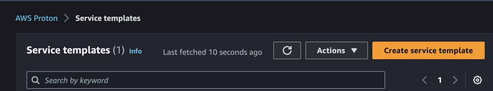
3. Fill in the required fields (The following instructions detail how to register the CMS Vehicle Simulator Module
template. The same steps can be applied to other modules as well by selecting the proper s3 path)
   1. Select the `Use your own template bundle in S3 Option`

      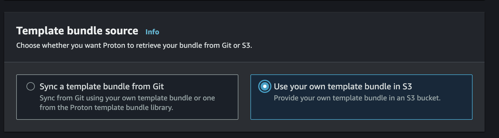
   2. Select `Browse S3` and locate the bucket where the templates were uploaded.

      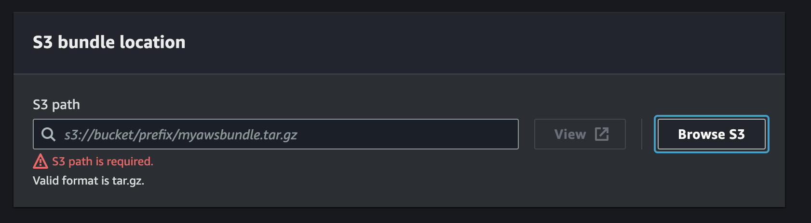

      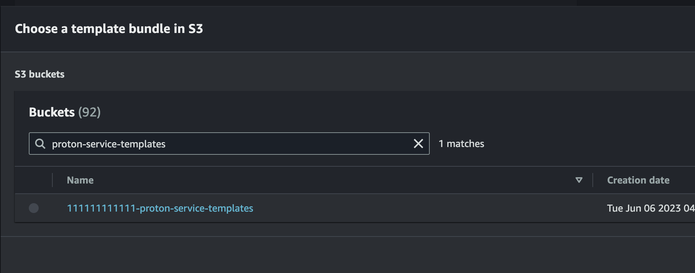
   3. Locate the latest tar for the vehicle_simulator module template (the Amazon S3 path should be of the
   format `../<SOLUTION_VERSION>/modules/<MODULE_NAME>/proton/`) Press the `Choose` button
      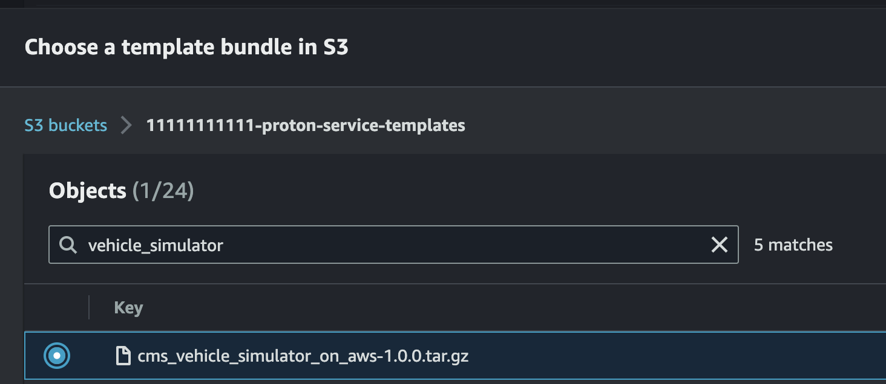
   4. In the repository, locate the [Vehicle Simulator Proton Template YAML](templates/modules/cms_vehicle_simulator_on_aws/template.yaml) and find the template name under the `metadataName` property. This will be under the `aws:proton:create-service` action. Use it to populate the `Service template name`
      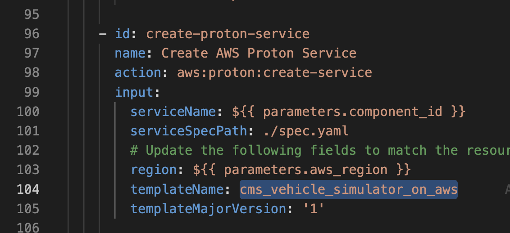
      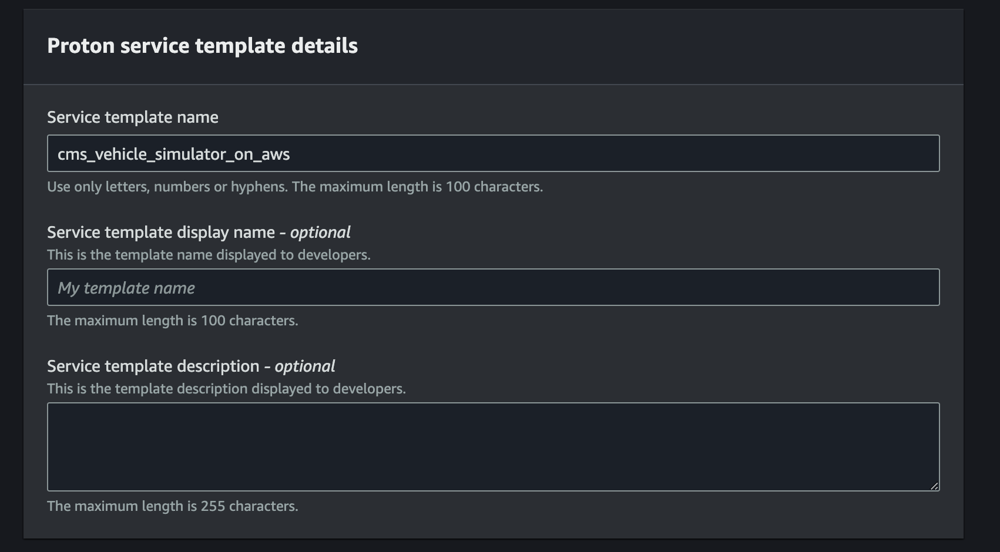
   5. Set the `Compatible environment templates` to `cms_environment`
      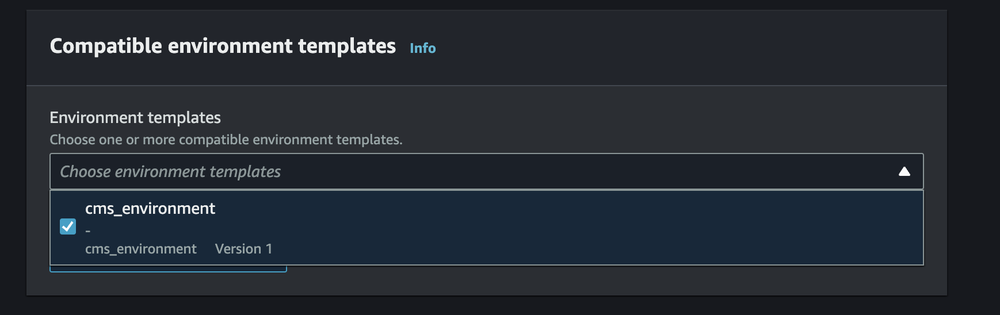
   6. Leave the remaining settings as default and click `Create Service Template`.
   7. After you receive a message stating `Successfully created service template cms_vehicle_simulator_on_aws.`, then select
   template version `1.0` and click `Publish` to make it available for use by Backstage
      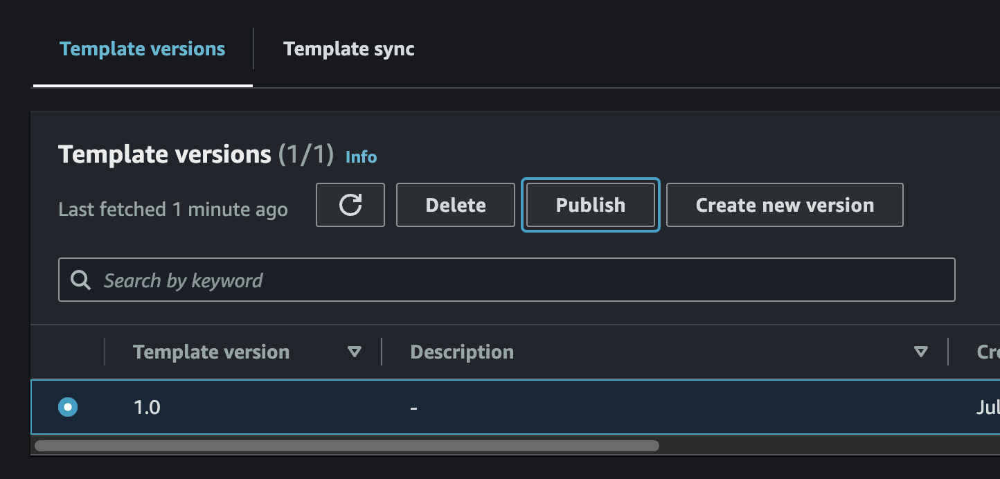

### Deploy CMS Modules via Backstage

#### CMS Module Deployment Order

Some CMS on AWS modules have dependencies on other modules and must be deployed in order.
Others do not have dependencies on other modules and can be deployed in any order, as long as the ACDP has been deployed first.

The deployment order that must be observed is as follows:

##### Deployment Order of Modules with Dependencies

1. CMS Authentication
2. CMS Alerts
3. CMS Connect and Store
4. CMS API
5. CMS EV Battery Health

##### Modules Without Dependencies

- CMS Vehicle Provisioning
- CMS Vehicle Simulator

#### Example Module Deployment via Backstage

The following instructions detail how to deploy the CMS Vehicle Simulator Module.
The same steps can be applied to other modules as well by replacing the URLs and names.

1.	Navigate to the CMS Backstage URL in a web browser (ROUTE53_BASE_DOMAIN that was specified during deployment).
2.	Sign in to Backstage using the credentials that were emailed to the user-email specified during deployment.
3.	Follow the prompts to create a new password and set up multi-factor authentication (MFA).
4. On Backstage, navigate to the `Create` page available from the `Catalog` menu in the side bar.
   Select the `CHOOSE` button on the `CMS Vehicle Simulator on AWS` card.
   

5. Fill in the form as required by the Vehicle Simulator template and click the `Next Step` button.
   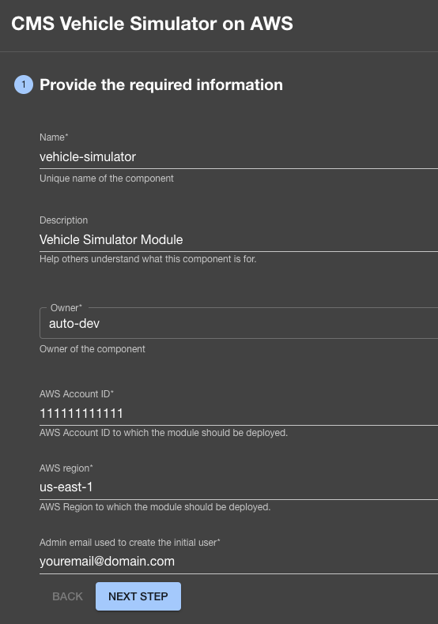

6. Click the `Create` button.

   

7. Monitor the deployment and ensure that the Vehicle Simulator module deploys successfully.

   

## Cost scaling

Refer to the implementation guide for pricing information.

## Collection of Operational Metrics

This solution collects anonymous operational metrics to help AWS improve
the quality and features of the solution. For more information, including
how to disable this capability, please see the
[implementation guide](https://docs.aws.amazon.com/solutions/latest/connected-mobility-solution-on-aws/operational-metrics.html).

## Teardown

This solution creates multiple CloudFormation deployments; both from the top level cdk deploy as well as additional stacks
from Proton and CodePipeline executions. Some resources cannot be torn down directly via the AWS Console or by using the AWS CLI.

The following commands assume the stage is `dev`, for other stages, replace `dev` with the appropriate value.

1. Capture and store the deployment UUID of the solution.

   - This is used to look for any resources not destroyed by CloudFormation after teardown completes

   ```bash
   make get-deployment-uuid
   ```

   output will be a uuidv4 string:

   ```bash
   XXXXXXXX-XXXX-XXXX-XXXX-XXXXXXXXXXXX
   ```

2. Delete CMS on AWS Modules in AWS Proton and CloudFormation that were deployed via Backstage
   1. In AWS Proton, Navigate to the `Services` view and delete any service attached to the
   `cms-environment` Environment. Wait until all services successfully delete.

      > **NOTE:** You have to click the link into the service to be able to delete it via the `Actions` dropdown

   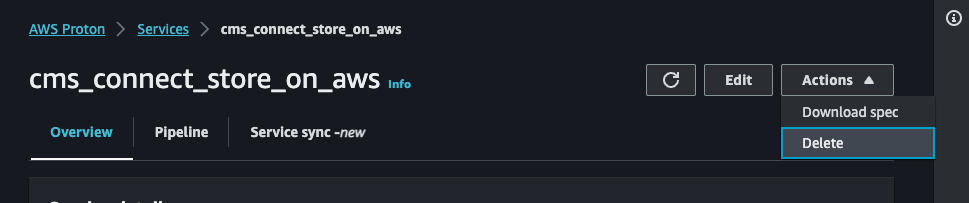
      - If the delete fails in AWS Proton, and the CodeBuild `cdk destroy` task shows an error in the CodeBuild logs, most likely the module attempting
        to be deleted has a dependency blocking the deletion. Continue tearing down the rest of the modules and try again.
        Refer to the AWS Proton CodeBuild logs and CloudFormation console output for additional information.
      - If the delete fails in AWS Proton, but the CloudFormation stack for the module is deleted successfully,
      most likely AWS Proton needs an additional role for account level CodeBuild. You might also see an error on the top of the screen reading
      `Validation exception...Operation cannot be run until pipeline roles have been configured.`
      or `AccountSettings.pipelineCodeBuildRoleArn has not been configured.`.
      In this case, go to `Account Settings` and configure a role.
         > **WARNING:** Proton's UI requires a GitHub Repository connection to configure roles.  To get around this, set the roles using a CLI command.
         Note that the CLI command uses the arn value for the roles in your account. Replace the "1" and "X" placeholders in the following command with
         the values found in the IAM console for your account.

         ```bash
         aws proton update-account-settings \
         --pipeline-codebuild-role-arn arn:aws:iam::11111111111:role/cms-dev-cmsprotonenvironmentprotoncodebuildroleXXX-XXXXXXXXXXXX \
         --pipeline-service-role-arn arn:aws:iam::11111111111:role/service-role/proton_role
         ```

   2. After AWS Proton shows that all services have been deleted, verify in the
      CloudFormation console that all CMS on AWS modules have been deleted, and if not, delete them.

3. Delete AWS Proton Service Templates, Environment, and Environment Templates.
      > **NOTE:** if you wish to keep services that have been deployed via backstage, skip these steps.
   1. Navigate to the `Service Templates` view in AWS Proton and delete any CMS on AWS service templates.

      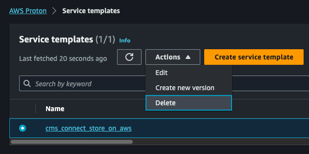

      > **WARNING:** If you receive the following Validation Exception: `Service template has major versions that must first be deleted.`,
      then you must run the delete command multiple times until all of the major versions have been deleted
      for the service template.

   2. Navigate to the `Environments` view and delete the `cms_environment` Environment.

      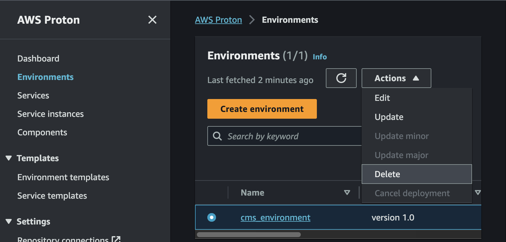

      > **WARNING:** If you receive the following Validation Exception:
       `Environment template has major versions that must first be deleted.`, then you must run the
        delete command multiple times until all of the major versions have been deleted for
        the environment template.

   3. Navigate to the `Environment Templates` view and delete the `cms_environment` Environment Template.
      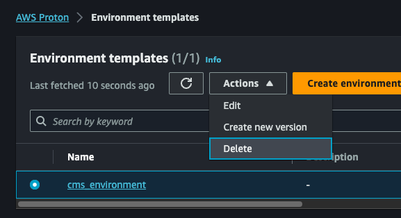

   4. Validate on the AWS Proton dashboard that all resources have been removed.
      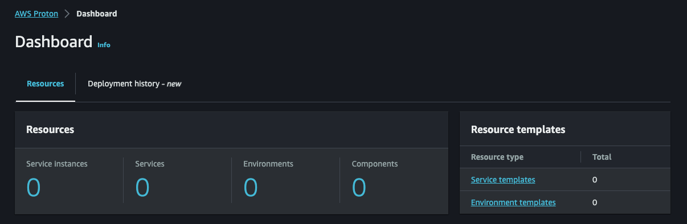

   5. Navigate to CloudFormation and delete the AWS Proton CodeBuild stack (AWSProton-Codebuild-#######).
      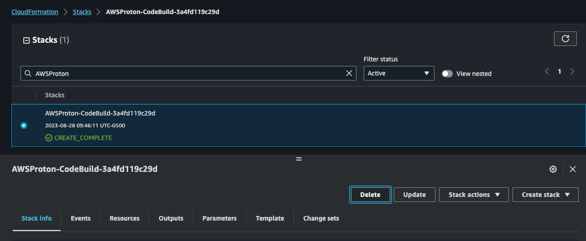

   6. Verify that the `cms-environment` stack was removed when tearing down AWS Proton, and if not, delete it.

4. Delete the Backstage CloudFormation Stacks

   Navigate to CloudFormation and delete the following stacks:
   - cms-backstage-dev
   - cms-backstage-env-dev

   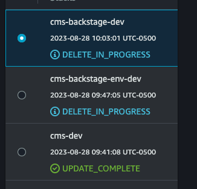

  > **NOTE:** The `cms-backstage-dev` stack might fail to delete due to the ACM certificate creation custom resource.
  After delete fails, click delete again and select retain on the custom resource.
  This will not leave any resources in the account.

  

1. Delete the CMS Backstage Amazon ECR repository

   Navigate to Amazon ECR, and delete the repository called `backstage`.

   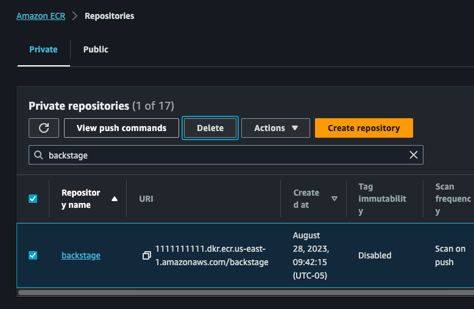

2. Delete the CMS on AWS CloudFormation Stacks

   > **NOTE:** The `cms-dev` stack in this step can only be deleted if the prevous steps for deleting `cms-backstage-*` stacks have finished.
   Please wait for the deletes to finish in the CloudFormation console before moving on.

   Navigate to CloudFormation and delete the `cms-environment` and `cms-dev` stacks.

   > **WARNING:** This is your last opportunity to capture the deployment UUID. Please make sure you have captured
   it using the make command specified in step 1 of the [Teardown](#teardown) section.

   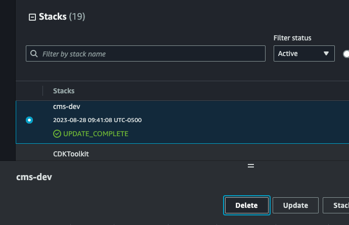

3. Manually cleanup the following resources:
   - S3 Buckets
   - Cognito User Pool
   - KMS Keys

   Locate the leftover resources using the following command which first requires you to export the `DEPLOYMENT_UUID` variable using the value previously acquired from AWS Systems Manager.

   If you tore down the CMS on AWS stack without capturing the UUID, the below command can be run by removing
   the `Solutions:DeploymentUUID` Key filter, however the results will include other CMS on AWS stacks if they exist,
   so use this method with caution.

   ```bash
   export DEPLOYMENT_UUID=<DEPLOYMENT_UUID_VALUE_FROM_SSM>

   aws resourcegroupstaggingapi get-resources --tag-filters \
   Key=Solutions:SolutionID,Values=SO0241 \
   Key=Solutions:DeploymentUUID,Values=$DEPLOYMENT_UUID \
   --query "ResourceTagMappingList[*].ResourceARN"
   ```

   This query results in a list of ARNs to assist you with locating the resources in the AWS Console. Resources can then be
   manually deleted, or deleted via a script, utilizing the resource ARNs where appropriate.

   > **WARNING:** Some resources may take some time to cleanup after CloudFormation finishes tearing down, and could show in the
   output even if they no longer exist.  For example, Amazon VPC, Fargate, and Amazon ECS resources can remain queryable for up to
   30 minutes after deletion.

   Example Output:
   ```json
   [
      "arn:aws:cognito-idp:us-east-1:11111111111:userpool/us-east-1_XXXXXXXX",
      "arn:aws:dynamodb:us-east-1:11111111111:table/cms-alerts-on-aws-stack-dev-cmsalertsusersubscriptionsconstructuseremailsubscriptionstableXXXXXXXXXXX",

      "arn:aws:ecs:us-east-1:11111111111:task-definition/cms-backstage-dev:1",
      "arn:aws:ecs:us-east-1:11111111111:task-definition/cms-backstage-dev:2",
      "arn:aws:s3:::cms-connect-store-on-aws-connectstoreconnectstore-XXXXXXXXXXX",
      "arn:aws:s3:::cms-dev-cmsprotonenvironmentprotonenvironmentbuck-XXXXXXXXXXX",
      "arn:aws:dynamodb:us-east-1:11111111111:table/cms-alerts-on-aws-stack-dev-cmsalertsnotificationconstructnotificationstableXXXXXXX-XXXXXXXXXX",
      "arn:aws:logs:us-east-1:11111111111:log-group:cms-backstage-dev-cmsbackstagebackstageloggroupXXXXXXXX-XXXXX",
      "arn:aws:logs:us-east-1:11111111111:log-group:cms-dev-cmspipelinescmsvpcloggroupXXXXXXXX-XXXXX",
      "arn:aws:s3:::cms-dev-cmspipelinesbackstagecodepipelineartifact-XXXXXXXXXX",
      "arn:aws:s3:::cms-backstage-dev-cmsbackstagebackstageelblogsbuc-XXXXXXXXXX",
      "arn:aws:acm:us-east-1:11111111111:certificate/XXXXXXXX-XXXX-XXXX-XXXX-XXXXXXXXXXXX",
      "arn:aws:cognito-idp:us-east-1:11111111111:userpool/us-east-1_XXXXXXX",
      "arn:aws:logs:us-east-1:11111111111:log-group:cms-connect-store-on-aws-stack-dev-connectstoreconnectstoreiotconnectivitylog1234abc-XXXXXXXXX",
      "arn:aws:rds:us-east-1:11111111111:cluster-snapshot:cms-backstage-env-dev-snapshot-cmsbackstageenvbackstageaurorapostgresXXXXX-XXXXXXXXX",
      "arn:aws:s3:::cms-connect-store-on-aws-connectstoreconnectstore-XXXXXXXXXXX",
      "arn:aws:s3:::cms-backstage-env-dev-cmsbackstageenvbackstagecat-XXXXXXXXXXX",
      "arn:aws:kms:us-east-1:11111111111:key/XXXXXXXX-XXXX-XXXX-XXXX-XXXXXXXXXXXX",
      "arn:aws:kms:us-east-1:11111111111:key/XXXXXXXX-XXXX-XXXX-XXXX-XXXXXXXXXXXX",
      "arn:aws:kms:us-east-1:11111111111:key/XXXXXXXX-XXXX-XXXX-XXXX-XXXXXXXXXXXX",
      "arn:aws:kms:us-east-1:11111111111:key/XXXXXXXX-XXXX-XXXX-XXXX-XXXXXXXXXXXX",
   ]
   ```

## Developer Guide

### Logging
By default, this solution implements safe logging which does not expose any sensitive or vulnerable information.
CMS on AWS does not currently support a one-step system for enabling more detailed debug logs.
To add additional logs to the solution, you are required to alter the source code.
Examples of logging implementations can be found in the existing Lambda functions.

#### Lambda functions
By default, the solution disabled Lambda event logging, which contains sensitive information.
However, this functionality is provided by the AWS Lambda Powertools library which is utilized by each Lambda function.
To quickly enable event logging, navigate to the Lambda function in the AWS Console and add the following Lambda environment variable:

```
POWERTOOLS_LOGGER_LOG_EVENT="true"
```

For other logging options and methods for enabling event logging,
see the [AWS Lambda Powertools documentation](https://docs.powertools.aws.dev/lambda/python/latest/core/logger/).

#### Backstage logs
By default, the solution's deployment instructions deploy the ACDP and Backstage with a log level of "INFO".
To enable debug logs for Backstage, change the following environment variable when you deploy the solution:

```
BACKSTAGE_LOG_LEVEL="DEBUG"
```

### Pre-Commit Hooks

This solution contains a number of linters and checks to ensure code quality.
If you are not planning to commit code back to source, you can run the pre-commit hooks manually
using the following command:

```bash
pre-commit run --all
```

### Unit Test

After making changes, run unit tests to make sure added customization
passes the tests:

```bash
./deployment/run-unit-tests.sh
```

## License

Copyright Amazon.com, Inc. or its affiliates. All Rights Reserved.

Licensed under the Apache License, Version 2.0 (the "License").
You may not use this file except in compliance with the License.
You may obtain a copy of the License at http://www.apache.org/licenses/LICENSE-2.0

Unless required by applicable law or agreed to in writing, software
distributed under the License is distributed on an "AS IS" BASIS,
WITHOUT WARRANTIES OR CONDITIONS OF ANY KIND, either express or implied.
See the License for the specific language governing permissions and
limitations under the License.
