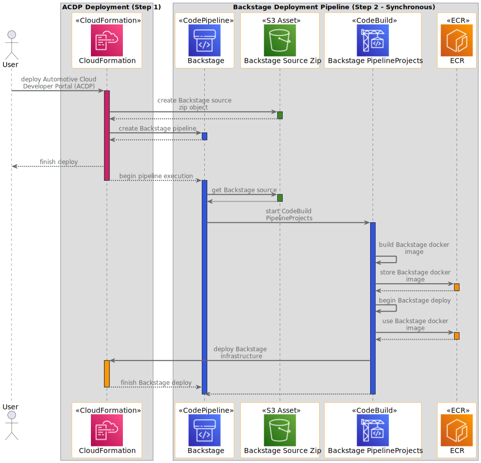
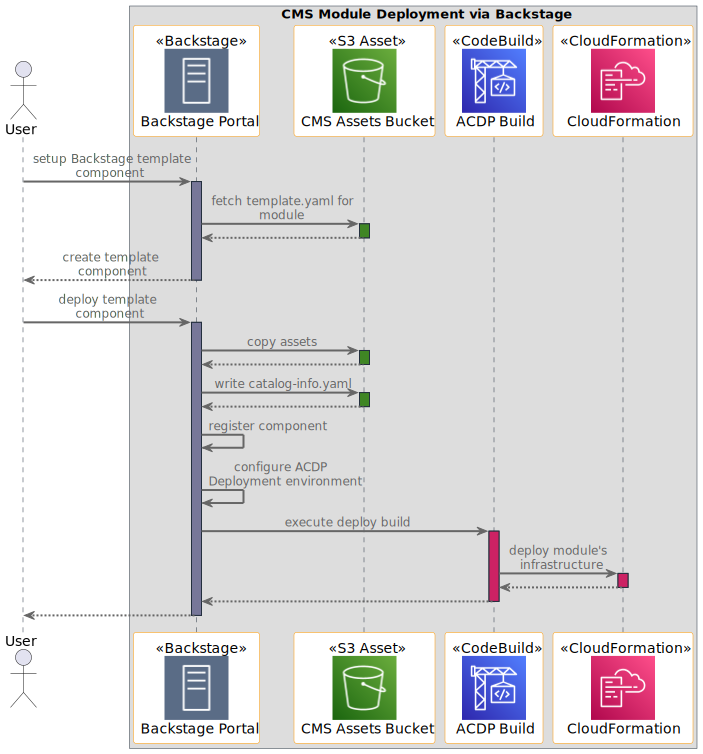
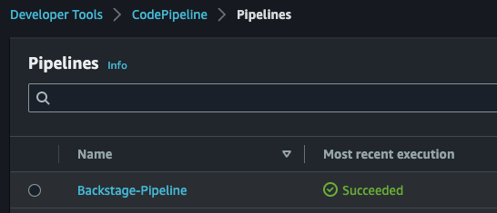
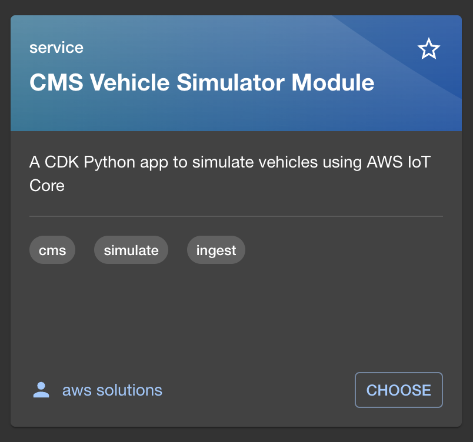
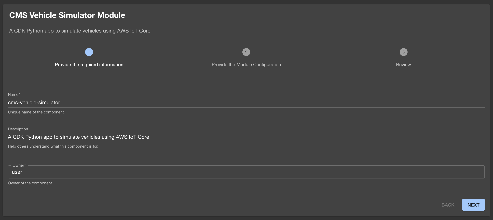
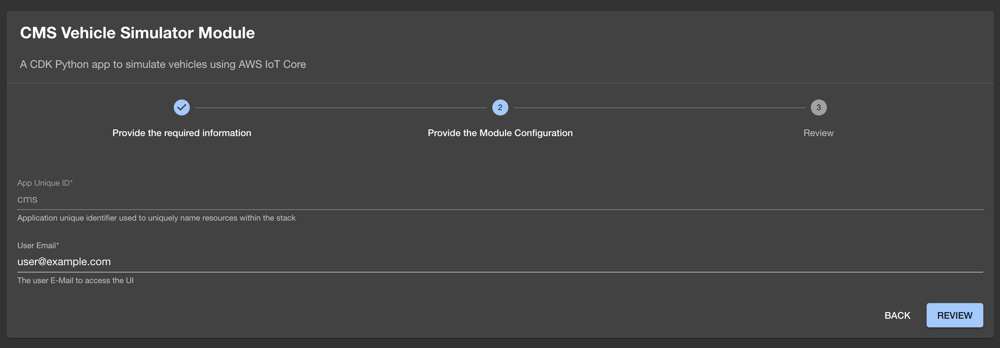
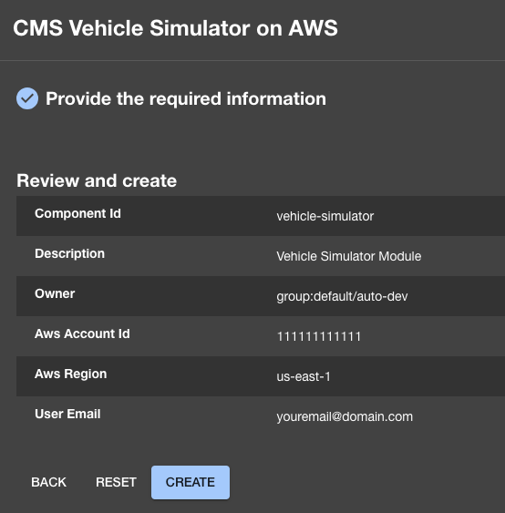
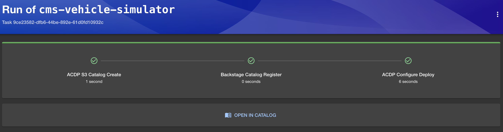

# Connected Mobility Solution on AWS
<!-- markdownlint-disable-next-line -->
**[Connected Mobility Solution on AWS](https://aws.amazon.com/solutions/implementations/connected-mobility-solution-on-aws/)** | **[🚧 Feature request](https://github.com/aws-solutions/connected-mobility-solution-on-aws/issues/new?assignees=&labels=enhancement&template=feature_request.md&title=)** | **[🐛 Bug Report](https://github.com/aws-solutions/connected-mobility-solution-on-aws/issues/new?assignees=&labels=bug&template=bug_report.md&title=)** | **[❓ General Question](https://github.com/aws-solutions/connected-mobility-solution-on-aws/issues/new?assignees=&labels=question&template=general_question.md&title=)**

**Note**: If you want to use the solution without building from source,
navigate to the [AWS Solution Page](https://aws.amazon.com/solutions/implementations/connected-mobility-solution-on-aws/).

**If you want to jump straight into building and deploying, [click here](#deployment-prerequisites)**

## Table of Contents

- [Connected Mobility Solution on AWS](#connected-mobility-solution-on-aws)
  - [Table of Contents](#table-of-contents)
  - [Solution Overview](#solution-overview)
  - [Architecture Diagrams](#architecture-diagrams)
    - [ACDP Architecture Diagram](#acdp-architecture-diagram)
    - [ACDP Deployment Sequence Diagram](#acdp-deployment-sequence-diagram)
    - [Module Deployment Sequence Diagram](#module-deployment-sequence-diagram)
  - [CMS Modules](#cms-modules)
  - [Deployment Prerequisites](#deployment-prerequisites)
    - [Clone the Repository](#clone-the-repository)
    - [Required Tools](#required-tools)
    - [Required Tool Versions](#required-tool-versions)
    - [Install Required Tools (OSX/Linux)](#install-required-tools-osxlinux)
      - [NVM](#nvm)
      - [Node / NPM](#node--npm)
      - [Yarn](#yarn)
      - [Pyenv](#pyenv)
      - [Python / Pip](#python--pip)
      - [Pipenv](#pipenv)
      - [AWS CLI](#aws-cli)
      - [AWS CDK Toolkit](#aws-cdk-toolkit)
      - [Verify Required Tool Installations](#verify-required-tool-installations)
    - [Install Solution Dependencies](#install-solution-dependencies)
    - [Create an Amazon Route 53 Hosted Zone](#create-an-amazon-route-53-hosted-zone)
    - [Setup Environment Variables](#setup-environment-variables)
  - [Deploy](#deploy)
    - [Prerequisites](#prerequisites)
    - [Build the Solution's Modules](#build-the-solutions-modules)
    - [Upload Assets to S3](#upload-assets-to-s3)
    - [Deploy on AWS](#deploy-on-aws)
    - [Monitoring the ACDP Deployment](#monitoring-the-acdp-deployment)
    - [Deploy CMS Modules via Backstage](#deploy-cms-modules-via-backstage)
      - [CMS Module Deployment Order](#cms-module-deployment-order)
        - [Deployment Order of Required CMS Config](#deployment-order-of-required-cms-config)
        - [Deployment Order of Modules with Dependencies](#deployment-order-of-modules-with-dependencies)
        - [Modules Without Dependencies After CMS Config](#modules-without-dependencies-after-cms-config)
      - [Example Module Deployment via Backstage](#example-module-deployment-via-backstage)
  - [Cost Scaling](#cost-scaling)
  - [Collection of Operational Metrics](#collection-of-operational-metrics)
  - [Uninstall the Solution](#uninstall-the-solution)
  - [Developer Guide](#developer-guide)
    - [Logging](#logging)
      - [Lambda Functions](#lambda-functions)
      - [Backstage Logs](#backstage-logs)
    - [Pre-Commit Hooks](#pre-commit-hooks)
    - [Unit Test](#unit-test)
  - [License](#license)

## Solution Overview

The Connected Mobility Solution (CMS) on AWS provides the automotive
industry customers the capability to communicate between vehicles and the
AWS Cloud, manage and orchestrate CMS on AWS deployments from a centralized
developer platform, securely authenticate and authorize users and services,
onboard vehicles into AWS IoT Core, create vehicle profiles for storing data
about registered vehicles, capture and store telemetry data emitted from
registered vehicles, and consume data from FleetWise campaigns. Additionally
it provides capabilities to query stored vehicle data, create alerts and subscribe
to notifications based on data thresholds, visualize vehicle telemetry data through
a provided dashboard, and simulate connected vehicle data.

For more information and a detailed deployment guide, visit the
[Connected Mobility Solution on AWS](https://aws.amazon.com/solutions/implementations/connected-mobility-solution-on-aws/)
solution page.

## Architecture Diagrams

### ACDP Architecture Diagram


### ACDP Deployment Sequence Diagram



### Module Deployment Sequence Diagram



## CMS Modules

For detailed information visit the modules' README

- [ACDP](./source/modules/acdp/README.md)
  - [Backstage](./source/modules/acdp/backstage/README.md)
- [Alerts](./source/modules/cms_alerts/README.md)
- [API](./source/modules/cms_api/README.md)
- [Auth](./source/modules/cms_auth/README.md)
- [Auth Setup](./source/modules/auth_setup/README.md)
- [Connect & Store](./source/modules/cms_connect_store/README.md)
- [Config](./source/modules/cms_config/README.md)
- [EV Battery Health](./source/modules/cms_ev_battery_health/README.md)
- [Fleetwise Connector](./source/modules/cms_fleetwise_connector/README.md)
- [Provisioning](./source/modules/cms_provisioning/README.md)
- [Vehicle Simulator](./source/modules/cms_vehicle_simulator/README.md)
- [VPC](./source/modules/vpc/README.md)

## Deployment Prerequisites

### Clone the Repository

If you have not done so, first clone the repository, and then `cd` into the created directory. If you have
already cloned the repository, ensure you still `cd` into the solution's directory.

```bash
git clone https://github.com/aws-solutions/connected-mobility-solution-on-aws.git
cd connected-mobility-solution-on-aws/
```

> **WARNING:** If you do not `cd` into the solution's directory before installing tools,
> the correct versions may not be installed.

### Required Tools

To deploy CMS on AWS, a variety of tools are required. These deploy instructions will install the following to your machine:

- [NVM](https://github.com/nvm-sh/nvm)
- [Node](https://nodejs.org/en)
- [NPM](https://www.npmjs.com/)
- [Yarn](https://yarnpkg.com/)
- [Pyenv](https://github.com/pyenv/pyenv)
- [Python](https://www.python.org/)
- [Pip](https://pypi.org/project/pip/)
- [Pipenv](https://pipenv.pypa.io/en/latest/installation.html)
- [AWS CLI](https://docs.aws.amazon.com/cli/)
- [AWS CDK Toolkit](https://docs.aws.amazon.com/cdk/v2/guide/cli.html)

### Required Tool Versions

Certain tools also require specific versions. See the table below for the appropriate versions. Following the
provided install instructions will install the correct versions.

For tools not listed here, stable versions should work appropriately.

| Dependency | Version  |
|------------|----------|
| [NodeJS](https://docs.npmjs.com/downloading-and-installing-node-js-and-npm)   | 18.17.*    |
| [Python](https://www.python.org)                                              | 3.10.*     |

### Install Required Tools (OSX/Linux)

Install the following tools in the order instructed here. Where appropriate, a script has been provided to aid in install.
Otherwise, please visit the installation guide provided by the tool's publisher to ensure a correct installation.

> **WARNING:** If after a successful installation, a command is not found, you may need to restart your terminal.

#### NVM

Follow the [nvm installation guide](https://github.com/nvm-sh/nvm#installing-and-updating) to install NVM.
Ensure your installation properly set your path by running the script below.

```bash
nvm --version
# Expected Output: x.xx.x
```

#### Node / NPM

```bash
nvm install
nvm use
```

For more information see the [nvm usage guide](https://github.com/nvm-sh/nvm#usage) for installing the correct
version of Node. Manually installing Node without the use of nvm is not recommended.

#### Yarn

Follow the [yarn installation guide](https://classic.yarnpkg.com/lang/en/docs/install/#mac-stable). Ensure your
installation properly set your path by running the script below.

```bash
yarn --version
# Expected Output: x.xx.xx
```

#### Pyenv

Follow the [pyenv installation guide](https://github.com/pyenv/pyenv#automatic-installer) to install Pyenv.
You will likely need to manually add Pyenv to your PATH by following the provided instructions. Ensure your
installation properly set your path by running the script below.

```bash
pyenv --version
# Expected Output: pyenv x.x.xx
```

#### Python / Pip

```bash
pyenv install -s
```

For more information see the [pyenv usage guide](https://github.com/pyenv/pyenv#usage) for installing the
correct version of Python. Manually installing Python without the use of pyenv is not recommended.

#### Pipenv

Follow the [pipenv installation guide](https://pipenv.pypa.io/en/latest/installation.html) to install Pipenv.
You will likely need to manually add Pipenv to your PATH by following the provided instructions. Ensure your
installation properly set your PATH by running the script below.

```bash
pipenv --version
# Expected Output: pipenv, version xxxx.xx.x
```

#### AWS CLI

Follow the installation instructions laid out in the
[AWS CLI install page](https://docs.aws.amazon.com/cli/latest/userguide/getting-started-install.html).
This install is OS specific, and includes multiple options for both a system wide, and user specific
install. Follow the install instructions most appropriate to you. Ensure your installation properly
set your PATH by running the script below.

```bash
aws --version
# Expected Output: aws-cli/x.xx.xx ...
```

#### AWS CDK Toolkit

Follow the [installation guide](https://docs.aws.amazon.com/cdk/v2/guide/cli.html) to install the
AWS CDK toolkit. Ensure your installation properly set your PATH by running the script below.

```bash
cdk --version
# Expected Output: x.xxx.x (build ...)
```

#### Verify Required Tool Installations

Run the following command to verify the proper installation of all of the tools listed above. If
any errors are displayed, attempt to reinstall that tool.

```bash
make verify-required-tools
```

### Install Solution Dependencies

Now that you have the correct tools, you can install the dependencies used by the solution using `make install`.
After installing, activate the environment which contains the dependencies.

```bash
make install
```

### Create an Amazon Route 53 Hosted Zone

To deploy the solution, an Amazon Route53 Hosted Zone is required to be setup in your account.
You will provide the domain for this hosted zone in the following step when you setup your environment variables.
This is a manual step. For more details, see
[Working with hosted zones](https://docs.aws.amazon.com/Route53/latest/DeveloperGuide/hosted-zones-working-with.html).

### Setup Environment Variables

To deploy the solution, a variety of environment variables are required. These environment variables will be used to
provide the values to your deployment. To generate the file which will store these environment variables and
provide their values, run the following command:

```bash
make deploy-variables
```

> **NOTE:** The `ROUTE53_ZONE_NAME` can be found from the Amazon Route53 Hosted Zone you setup in the previous step.
Use the AWS Management Console to find this domain.

## Deploy

Refer to the [deployment diagram](#architecture-diagrams) for a detailed walk-through of what is deployed.

### Prerequisites

Ensure you've followed the steps in the previous [deployment prerequisites](#deployment-prerequisites) section.

- Prerequisite tools installed. Refer to the [install required tools](#install-required-tools-osxlinux) sections for details.
- Solution dependencies installed. Refer to the [install solution dependencies](#install-solution-dependencies)
  section for details.
- An Amazon Route53 Hosted Zone in the deployment account. Refer to the
[create an Amazon Route 53 Hosted Zone](#create-an-amazon-route-53-hosted-zone) section for details.
- Environment variables set. Refer to the [setup environment variables](#setup-environment-variables) section for details.

### Build the Solution's Modules

The build target manages dependencies, builds required assets (e.g. packaged lambdas), and creates the
AWS CloudFormation templates for all modules.

```bash
make build-all
```

### Upload Assets to S3

The upload target creates the necessary buckets for, and uploads, the global and regional assets.
It also uploads the Backstage .zip asset.

```bash
make upload
```

### Deploy on AWS

The deploy target deploys all CMS modules, including the ACDP, in an enforced order.

```bash
make deploy
```

### Monitoring the ACDP Deployment

After the CDK deployment is completed, browse to [CodePipeline](https://console.aws.amazon.com/codesuite/codepipeline/pipelines)
in the AWS Management Console and verify that the "Backstage-Pipeline" execution completes successfully.



After the pipeline has completed, the deployment can be considered successfully complete and Backstage is ready for use.

> **NOTE:** It can take up to **10 minutes** after the Backstage pipeline completes for Amazon Cognito's auth domain to become
> available for use with Backstage. If your Backstage domain will not load, please wait and try again.

### Deploy CMS Modules via Backstage

#### CMS Module Deployment Order

All CMS modules have dependencies on the initial three deployments for configuring CMS.

Some CMS on AWS modules have secondary dependencies on other modules and must be deployed in order.

The rest of the modules do not have dependencies on other modules and can be deployed in any order after CMS Config.

The deployment order that must be observed is as follows:

##### Deployment Order of Required CMS Config

1. VPC
2. Auth Setup
3. CMS Config

##### Deployment Order of Modules with Dependencies

1. CMS Auth
2. CMS Connect & Store
3. CMS Alerts
4. CMS API
5. CMS EV Battery Health
6. CMS FleetWise Connector

##### Modules Without Dependencies After CMS Config

- CMS Vehicle Provisioning
- CMS Vehicle Simulator

#### Example Module Deployment via Backstage

The following instructions detail how to deploy the CMS Vehicle Simulator module.
The same steps can be applied to other modules as well by replacing the URLs and names.

1. Navigate to the Backstage URL in a web browser (ROUTE53_BASE_DOMAIN that was specified during deployment).
2. Sign in to Backstage using the credentials that were emailed to the user-email specified during deployment.
3. Follow the prompts to create a new password and set up multi-factor authentication (MFA).
4. On Backstage, navigate to the `Create` page available from the `Catalog` menu in the side bar.
   Select the `CHOOSE` button on the `CMS Vehicle Simulator` card.
   

5. Fill in the form as required by the Vehicle Simulator template and click the `Next` button and then the `Review` button.
   
   

6. Click the `Create` button.

   

7. Monitor the deployment and ensure that the Vehicle Simulator module deploys successfully.

   

## Cost Scaling

In general, cost can differ dramatically based on usage of CMS.

For at rest cost and detailed pricing information, see the
[implementation guide](https://docs.aws.amazon.com/solutions/latest/connected-mobility-solution-on-aws/cost.html).

## Collection of Operational Metrics

This solution collects anonymized operational metrics to help AWS improve
the quality and features of the solution. For more information, including
how to disable this capability, please see the
[implementation guide](https://docs.aws.amazon.com/solutions/latest/connected-mobility-solution-on-aws/anonymized-data-collection.html).

## Uninstall the Solution

1. Capture and store the deployment UUIDs of the solution.

   - This is used to look for any resources not destroyed by CloudFormation after teardown completes

   ```bash
   make get-acdp-deployment-uuid
   make get-cms-deployment-uuid
   ```

   the outputs will be uuidv4 strings, capture and store both:

   ```bash
   XXXXXXXX-XXXX-XXXX-XXXX-XXXXXXXXXXXX
   ```

1. Delete CMS modules in order.

   ```bash
   make destroy
   ```

  > **NOTE:** Backstage might fail to delete due to the ACM certificate creation custom resource.
  After delete fails, click delete again and select retain on the custom resource.
  This will not leave any resources in the account.

  

1. Delete the Backstage ACM Certificate (optional)

   Navigate to Amazon Certificate Manager, and delete the Backstage certificate.

1. Manually cleanup the following resources:

- S3 buckets
- DynamoDB tables
- Cognito user pool
- KMS keys

   Locate the leftover resources using the following command which first requires you to export the `DEPLOYMENT_UUID`
   variable using each of the values previously acquired from AWS Systems Manager.

   If you tore down the ACDP stack without capturing the UUIDs, the below command can be run by removing
   the `Solutions:DeploymentUUID` Key filter, however the results will include other CMS on AWS stacks if they exist,
   so use this method with caution.

   ```bash
   export DEPLOYMENT_UUID=<DEPLOYMENT_UUID_VALUE_FROM_SSM>

   aws resourcegroupstaggingapi get-resources --tag-filters \
   Key=Solutions:SolutionID,Values=SO0241 \
   Key=Solutions:DeploymentUUID,Values=$DEPLOYMENT_UUID \
   --query "ResourceTagMappingList[*].ResourceARN"
   ```

   This query results in a list of ARNs to assist you with locating the resources in the AWS Management Console.
   Resources can then be manually deleted, or deleted via a script, utilizing the resource ARNs where appropriate.

   > **WARNING:** Some resources may take some time to cleanup after CloudFormation finishes tearing down, and could
    show in the output even if they no longer exist.  For example, Amazon VPC, Fargate, and Amazon ECS resources can
    remain queryable for up to 30 minutes after deletion.

## Developer Guide

### Logging

By default, this solution implements safe logging which does not expose any sensitive or vulnerable information.
CMS on AWS does not currently support a one-step system for enabling more detailed debug logs.
To add additional logs to the solution, you are required to alter the source code.
Examples of logging implementations can be found in the existing Lambda functions.

#### Lambda Functions

By default, the solution disabled Lambda event logging, which contains sensitive information.
However, this functionality is provided by the AWS Lambda Powertools library which is utilized by each Lambda function.
To quickly enable event logging, navigate to the Lambda function in the AWS Management Console and add the following Lambda
environment variable:

```bash
POWERTOOLS_LOGGER_LOG_EVENT="true"
```

For other logging options and methods for enabling event logging,
see the [AWS Lambda Powertools documentation](https://docs.powertools.aws.dev/lambda/python/latest/core/logger/).

#### Backstage Logs

By default, the solution's deployment instructions deploy the ACDP and Backstage with a log level of "INFO".
To enable debug logs for Backstage, change the following environment variable when you deploy the solution:

```bash
export BACKSTAGE_LOG_LEVEL="debug"
```

### Pre-Commit Hooks

This solution contains a number of linters and checks to ensure code quality. If you are not planning to commit code
back to source, you can run the pre-commit hooks manually using the following command:

```bash
make pre-commit-all
```

### Unit Test

After making changes, run unit tests to make sure added customization passes the tests:

```bash
make unit-test
```

## License

Copyright Amazon.com, Inc. or its affiliates. All Rights Reserved.

Licensed under the Apache License, Version 2.0 (the "License").
You may not use this file except in compliance with the License.
You may obtain a copy of the License at <http://www.apache.org/licenses/LICENSE-2.0>

Unless required by applicable law or agreed to in writing, software
distributed under the License is distributed on an "AS IS" BASIS,
WITHOUT WARRANTIES OR CONDITIONS OF ANY KIND, either express or implied.
See the License for the specific language governing permissions and
limitations under the License.
