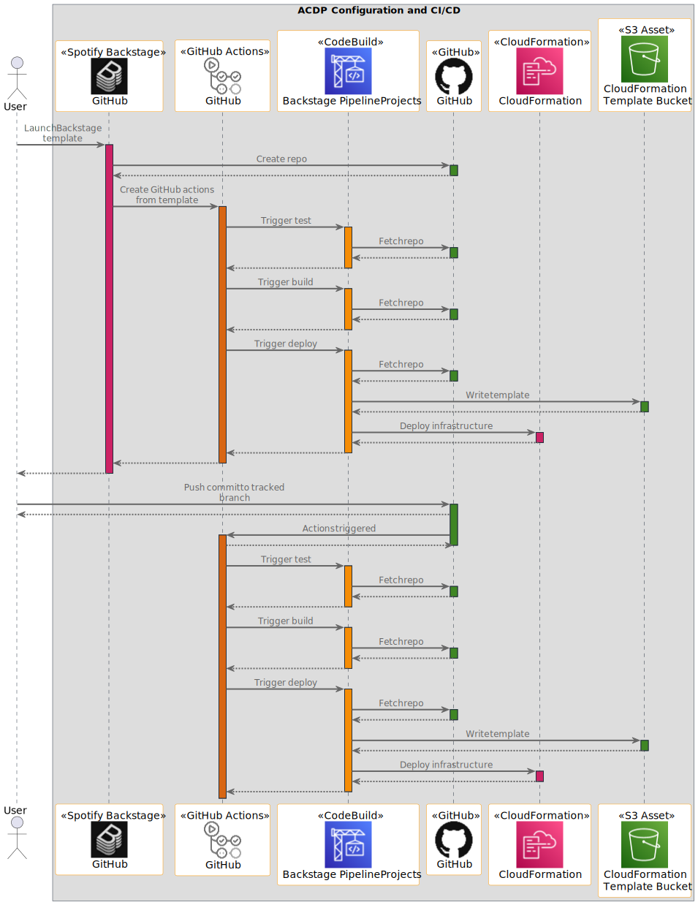

# Connected Mobility Solution on AWS - Automotive Cloud Developer Portal (ACDP) Module
<!-- markdownlint-disable-next-line -->
**[Connected Mobility Solution on AWS](https://aws.amazon.com/solutions/implementations/connected-mobility-solution-on-aws/)** | **[🚧 Feature request](https://github.com/aws-solutions/connected-mobility-solution-on-aws/issues/new?assignees=&labels=enhancement&template=feature_request.md&title=)** | **[🐛 Bug Report](https://github.com/aws-solutions/connected-mobility-solution-on-aws/issues/new?assignees=&labels=bug&template=bug_report.md&title=)** | **[❓ General Question](https://github.com/aws-solutions/connected-mobility-solution-on-aws/issues/new?assignees=&labels=question&template=general_question.md&title=)**

**Note**: If you want to use the solution without building from source, navigate to the
[AWS Solution Page](https://aws.amazon.com/solutions/implementations/connected-mobility-solution-on-aws/).

## Table of Contents

- [Connected Mobility Solution on AWS - Automotive Cloud Developer Portal (ACDP) Module](#connected-mobility-solution-on-aws---automotive-cloud-developer-portal-acdp-module)
  - [Table of Contents](#table-of-contents)
  - [Solution Overview](#solution-overview)
  - [Architecture Diagram](#architecture-diagram)
  - [Sequence Diagram](#sequence-diagram)
  - [AWS CDK and Solutions Constructs](#aws-cdk-and-solutions-constructs)
  - [Customizing the Module](#customizing-the-module)
  - [Prerequisites](#prerequisites)
    - [MacOS Installation Instructions](#macos-installation-instructions)
    - [Clone the Repository](#clone-the-repository)
    - [Install Required Dependencies](#install-required-dependencies)
    - [Unit Test](#unit-test)
    - [Build the Module](#build-the-module)
    - [Upload Assets to S3](#upload-assets-to-s3)
    - [Deploy on AWS](#deploy-on-aws)
    - [Delete](#delete)
  - [Multi Account, Multi Region Deployment Support \[Optional\]](#multi-account-multi-region-deployment-support-optional)
  - [Usage](#usage)
    - [Auth](#auth)
    - [ECR Respository](#ecr-respository)
    - [CodeBuild](#codebuild)
    - [IAM](#iam)
  - [Cost Scaling](#cost-scaling)
  - [Collection of Operational Metrics](#collection-of-operational-metrics)
  - [License](#license)

## Solution Overview

The Automotive Cloud Developer Portal (ACDP) is the centralized platform for
deploying subsequent CMS on AWS modules. The ACDP use Backstage module as its presentation layer to provide
configurable developer platform for managing and monitoring the deployment of CMS on AWS modules and customer
provided modules.

The initial deployment of CMS on AWS includes the ACDP and Backstage, which assist in managing the deployment
of CMS on AWS modules. The ACDP provides a presentation layer through the Backstage module,
which you can use to select, configure, and deploy individual modules. Backstage also allows
for monitoring and teardown of these modules, as well as viewing of module documentation.
Backstage integrates with AWS CodeBuild for deployment execution. The ACDP is a powerful platform that enables
flexibility and quick insights into deployed infrastructure.

Deploying the ACDP creates and configures an AWS CodePipeline for deploying the Backstage module.
The pipeline is configured with the necessary environment to carry out the Backstage deployment.
Values for this configuration are taken from the local environment of the ACDP deploy, which is configured with Make.
An Amazon ECR repository is created and permissions are shared between it and the backstage pipeline.

For more details, see
[ACDP module](https://docs.aws.amazon.com/solutions/latest/connected-mobility-solution-on-aws/automotive-cloud-developer-portal.html)
 and [Backstage module](https://docs.aws.amazon.com/solutions/latest/connected-mobility-solution-on-aws/backstage-module.html)

## Architecture Diagram


## Sequence Diagram




## AWS CDK and Solutions Constructs

[AWS Cloud Development Kit (AWS CDK)](https://aws.amazon.com/cdk/) and
[AWS Solutions Constructs](https://aws.amazon.com/solutions/constructs/) make it easier to consistently create
well-architected infrastructure applications. All AWS Solutions Constructs are reviewed by AWS and use best
practices established by the AWS Well-Architected Framework.

In addition to the AWS Solutions Constructs, the solution uses AWS CDK directly to create infrastructure resources.

## Customizing the Module

## Prerequisites

- [Python 3.12+](https://www.python.org/downloads/)
- [NVM](https://github.com/nvm-sh/nvm)
- [NPM 8+](https://docs.npmjs.com/downloading-and-installing-node-js-and-npm)
- [Node 18+](https://docs.npmjs.com/downloading-and-installing-node-js-and-npm)
- [Pipenv](https://pipenv.pypa.io/en/latest/installation.html)

### MacOS Installation Instructions

Pyenv [Github Repository](https://github.com/pyenv/pyenv)

```bash
brew install pyenv
pyenv install 3.12
```

Pipenv [Github Repository](https://github.com/pypa/pipenv)

```bash
pip install --user pipenv
pipenv sync --dev
```

NVM [Github Repository](https://github.com/nvm-sh/nvm)

```bash
curl -o- https://raw.githubusercontent.com/nvm-sh/nvm/v0.39.3/install.sh | bash
```

NPM/Node [Official Documentation](https://docs.npmjs.com/downloading-and-installing-node-js-and-npm)

```bash
nvm install 18
nvm use 18
```

### Clone the Repository

```bash
git clone https://github.com/aws-solutions/connected-mobility-solution-on-aws.git
cd connected-mobility-solution-on-aws/source/modules/acdp
```

### Install Required Dependencies

```bash
make install
```

### Unit Test

After making changes, run unit tests to make sure added customization passes the tests:

```bash
make test
```

### Build the Module

The build script manages dependencies, builds required assets (e.g. packaged lambdas), and creates the
AWS Cloudformation templates.

```bash
make build
```

### Upload Assets to S3

```bash
make upload
```

### Deploy on AWS

```bash
make deploy
```

### Delete

```bash
make destroy
```

## Multi Account, Multi Region Deployment Support [Optional]

This module provides necessary guidance and infrastructure (in Backstage) to enable
Multi Account, Multi Region deployment support. In order to enable it, you need to set
`ENABLE_MULTI_ACCOUNT_DEPLOYMENT=true` and provide valid values for
`ORGS_MANAGEMENT_AWS_ACCOUNT_ID` and `ORGS_MANAGEMENT_ACCOUNT_REGION` before
deploying this module.

Post deployment, you need to deploy guidance stacks. Follow [Guidance README](./guidance/README.md) for instructions.

## Usage

### Auth

For more information on authentication and authorization for the Backstage portal and backend APIs deployed as part
of the ACDP deployment, see the [Backstage README](../backstage/README.md#auth).

### ECR Respository

- Backstage ECR Repository:
  - An ECR Repository that stores ACDP Backstage module image.

### CodeBuild

- Backstage Build Pipeline Project
  - CodeBuild pipeline which extracts and builds Backstage image stored in ECR Repository.
- Backstage Deploy Pipeline Project
  - CodeBuild pipeline that deploys the Backstage instance which was built by Backstage Build Pipeline Project.
- Module Deploy CodeBuild Project
  - CodeBuild project that will be used by Backstage to deploy modules.

### IAM

- CloudFormation IAM Role
  - An IAM Role that would be used by CloudFormation service to deploy CloudFormation Template in the account.

## Cost Scaling

Cost will scale depending on the amount of templates and assets used, network traffic, and number of deployments.

- [Amazon CodeBuild Cost](https://aws.amazon.com/codebuild/pricing/)
- [Amazon ECR Cost](https://aws.amazon.com/lambda/ecr)

For more details, see the
[implementation guide](https://docs.aws.amazon.com/solutions/latest/connected-mobility-solution-on-aws/cost.html).

## Collection of Operational Metrics

This solution collects anonymized operational metrics to help AWS improve
the quality and features of the solution. For more information, including
how to disable this capability, please see the
[implementation guide](https://docs.aws.amazon.com/solutions/latest/connected-mobility-solution-on-aws/anonymized-data-collection.html).

## License

Copyright Amazon.com, Inc. or its affiliates. All Rights Reserved.

Licensed under the Apache License, Version 2.0 (the "License").
You may not use this file except in compliance with the License.
You may obtain a copy of the License at <http://www.apache.org/licenses/LICENSE-2.0>

Unless required by applicable law or agreed to in writing, software
distributed under the License is distributed on an "AS IS" BASIS,
WITHOUT WARRANTIES OR CONDITIONS OF ANY KIND, either express or implied.
See the License for the specific language governing permissions and
limitations under the License.
