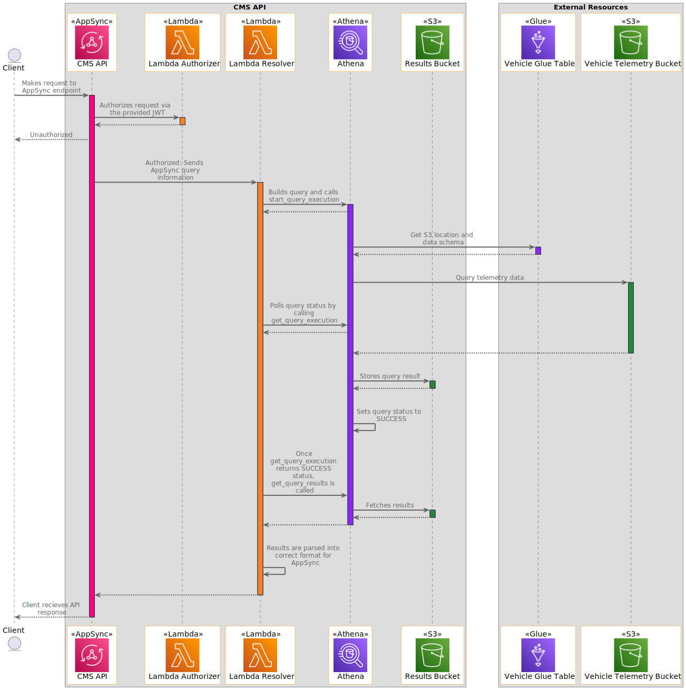

# Connected Mobility Solution on AWS - API Module
<!-- markdownlint-disable-next-line -->
**[Connected Mobility Solution on AWS](https://aws.amazon.com/solutions/implementations/connected-mobility-solution-on-aws/)** | **[🚧 Feature request](https://github.com/aws-solutions/connected-mobility-solution-on-aws/issues/new?assignees=&labels=enhancement&template=feature_request.md&title=)** | **[🐛 Bug Report](https://github.com/aws-solutions/connected-mobility-solution-on-aws/issues/new?assignees=&labels=bug&template=bug_report.md&title=)** | **[❓ General Question](https://github.com/aws-solutions/connected-mobility-solution-on-aws/issues/new?assignees=&labels=question&template=general_question.md&title=)**

**Note**: If you want to use the solution without building from source, navigate to the [AWS Solution Page](https://aws.amazon.com/solutions/implementations/connected-mobility-solution-on-aws/).

## Table of Contents

- [Connected Mobility Solution on AWS - API Module](#connected-mobility-solution-on-aws---api-module)
  - [Table of Contents](#table-of-contents)
  - [Solution Overview](#solution-overview)
  - [Architecture Diagram](#architecture-diagram)
  - [Sequence Diagram](#sequence-diagram)
  - [AWS CDK and Solutions Constructs](#aws-cdk-and-solutions-constructs)
  - [Customizing the Module](#customizing-the-module)
  - [Prerequisites](#prerequisites)
    - [MacOS Installation Instructions](#macos-installation-instructions)
    - [Clone the Repository](#clone-the-repository)
    - [Install Required Dependencies](#install-required-dependencies)
    - [Unit Test](#unit-test)
    - [Build the Module](#build-the-module)
    - [Upload Assets to S3](#upload-assets-to-s3)
    - [Deploy on AWS](#deploy-on-aws)
    - [Delete](#delete)
    - [GraphQL](#graphql)
    - [Authorization](#authorization)
    - [Adding GraphQL Operations](#adding-graphql-operations)
    - [Generate GraphQL Schema](#generate-graphql-schema)
    - [Generate Postman Collection](#generate-postman-collection)
  - [Cost Scaling](#cost-scaling)
  - [Collection of Operational Metrics](#collection-of-operational-metrics)
  - [License](#license)

## Solution Overview

CMS API is a deployable module within [Connected Mobility Solution on AWS](/README.md) (CMS)
that provides a centralized GraphQL API to serve telemetric data to authorized consumers using `AppSync`.

For more information and a detailed deployment guide, visit the
[CMS API](https://docs.aws.amazon.com/solutions/latest/connected-mobility-solution-on-aws/api-module.html)
Implementation Guide page.

## Architecture Diagram


## Sequence Diagram



## AWS CDK and Solutions Constructs

[AWS Cloud Development Kit (AWS CDK)](https://aws.amazon.com/cdk/) and
[AWS Solutions Constructs](https://aws.amazon.com/solutions/constructs/) make it easier to consistently create
well-architected infrastructure applications. All AWS Solutions Constructs are reviewed by AWS and use best
practices established by the AWS Well-Architected Framework.

In addition to the AWS Solutions Constructs, the solution uses AWS CDK directly to create infrastructure resources.

## Customizing the Module

## Prerequisites

- [Python 3.12+](https://www.python.org/downloads/)
- [NVM](https://github.com/nvm-sh/nvm)
- [NPM 8+](https://docs.npmjs.com/downloading-and-installing-node-js-and-npm)
- [Node 18+](https://docs.npmjs.com/downloading-and-installing-node-js-and-npm)
- [Pipenv](https://pipenv.pypa.io/en/latest/installation.html)

### MacOS Installation Instructions

Pyenv [Github Repository](https://github.com/pyenv/pyenv)

```bash
brew install pyenv
pyenv install 3.12
```

Pipenv [Github Repository](https://github.com/pypa/pipenv)

```bash
pip install --user pipenv
pipenv install --dev
```

NVM [Github Repository](https://github.com/nvm-sh/nvm)

```bash
curl -o- https://raw.githubusercontent.com/nvm-sh/nvm/v0.39.3/install.sh | bash
```

NPM/Node [Official Documentation](https://docs.npmjs.com/downloading-and-installing-node-js-and-npm)

```bash
nvm install 18
nvm use 18
```

### Clone the Repository

```bash
git clone https://github.com/aws-solutions/connected-mobility-solution-on-aws.git
cd connected-mobility-solution-on-aws/source/modules/cms_api/
```

### Install Required Dependencies

```bash
make install
```

### Unit Test

After making changes, run unit tests to make sure added customization
passes the tests:

```bash
make test
```

### Build the Module

The build script manages dependencies, builds required assets (e.g. packaged lambdas), and creates the
AWS Cloudformation templates.

```bash
make build
```

### Upload Assets to S3

```bash
make upload
```

### Deploy on AWS

```bash
make deploy
```

### Delete

```bash
make destroy
```

### GraphQL

The CMS API module implements a GraphQL API for serving vehicle data. You can learn more about GraphQL and how to
use it [here](https://graphql.org/learn/).

### Authorization

Users of the API will need to provide a valid bearer token in the Authorization header of each request. This should
be an access token obtained from the token endpoint of the configured Identity Provider.

### Adding GraphQL Operations

The graphql file containing the available operations is located at `./source/infrastructure/assets/graphql/schemas/vss_operations.graphql`.
At synthesis time this file and all others located in this directory are bundled into a single graphql schema file named
`vss_schema.graphql`.

To add additional operations the `vss_operations.graphql` file should be updated with the new query or mutation type.
Also, changes should be made to the Athena data source lambda to build and execute the correct Athena query for that operation.

### Generate GraphQL Schema

The data models used by CMS are generated by scripts offered by the
[vss-tools](https://github.com/COVESA/vss-tools/blob/e95d3f24b0cb161873dd53b39fe8ecbecfe8706c/docs/VSS2GRAPHQL.md)
repository. Assets for the default data models are already configured for the solution, however, a user may want to
 use a different version of the VSS specification or fork the repository and customize the specification to fit their
 needs. This can be done using the `script_generate_models.py` script provided:

```bash
python ./Connected-mobility-solution-on-aws/deployment/script_generate_models.py
```

After generating new models, the files must be moved to the appropriate location within the repository and replace
the existing models. In CMS API `./source/infrastructure/assets/graphql/schemas/vss_types.graphql` must be updated
with the newly generated file.

### Generate Postman Collection

After deploying the solution a Postman collection can be generated to test and interact with the API.

```bash
cd ./deployment/postman_collection
npm install
node index.js --stack-name <name-of-cloud-formation-stack> --region <region-of-cloud-formation-stack>
```

A file named `cms_graphql_api_postman_collection.json` will be generated that can be
[imported into Postman](https://learning.postman.com/docs/getting-started/importing-and-exporting/importing-data/).

## Cost Scaling

Cost will scale on the size of the data the Athena query scans and longer scan times incurring greater lambda costs.
At rest, the API's cost is minimal.

- [Athena Cost](https://aws.amazon.com/athena/pricing/)
- [AppSync Cost](https://aws.amazon.com/appsync/pricing/)
- [AWS Lambda Cost](https://aws.amazon.com/lambda/pricing/)

For more details, see the
[implementation guide](https://docs.aws.amazon.com/solutions/latest/connected-mobility-solution-on-aws/cost.html).

## Collection of Operational Metrics

This solution collects anonymized operational metrics to help AWS improve
the quality and features of the solution. For more information, including
how to disable this capability, please see the
[implementation guide](https://docs.aws.amazon.com/solutions/latest/connected-mobility-solution-on-aws/anonymized-data-collection.html).

## License

Copyright Amazon.com, Inc. or its affiliates. All Rights Reserved.

Licensed under the Apache License, Version 2.0 (the "License").
You may not use this file except in compliance with the License.
You may obtain a copy of the License at <http://www.apache.org/licenses/LICENSE-2.0>

Unless required by applicable law or agreed to in writing, software
distributed under the License is distributed on an "AS IS" BASIS,
WITHOUT WARRANTIES OR CONDITIONS OF ANY KIND, either express or implied.
See the License for the specific language governing permissions and
limitations under the License.
