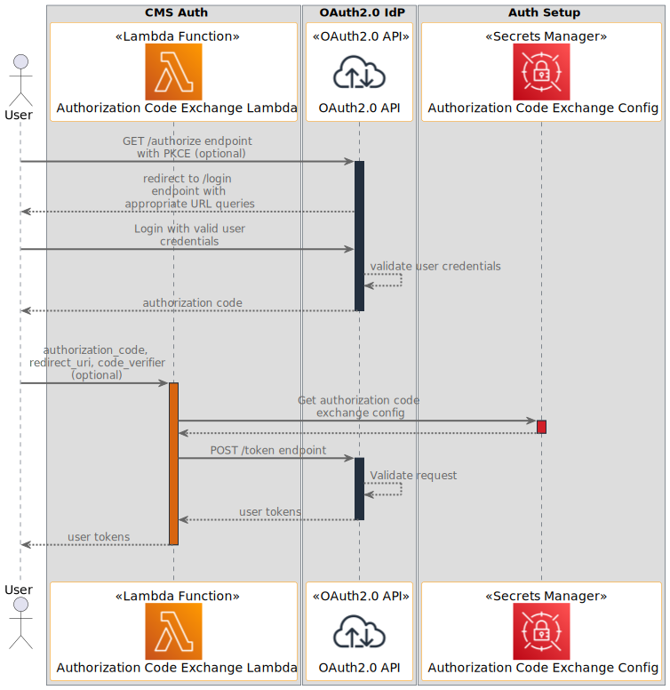
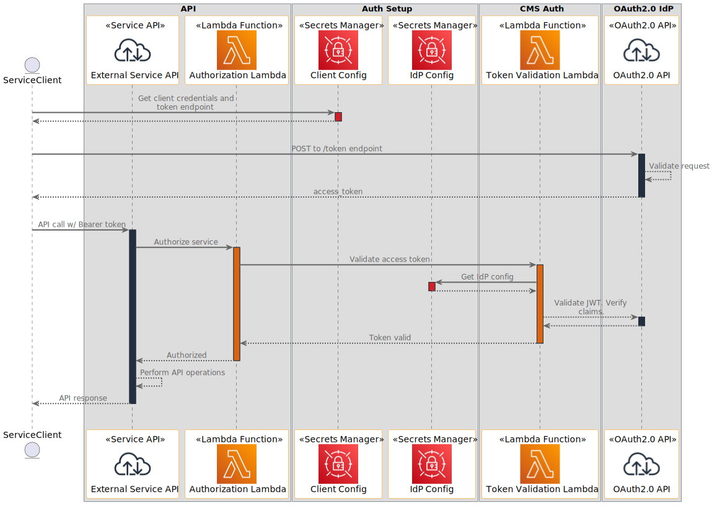

# Connected Mobility Solution on AWS - Auth Module
<!-- markdownlint-disable-next-line -->
**[Connected Mobility Solution on AWS](https://aws.amazon.com/solutions/implementations/connected-mobility-solution-on-aws/)** | **[🚧 Feature request](https://github.com/aws-solutions/connected-mobility-solution-on-aws/issues/new?assignees=&labels=enhancement&template=feature_request.md&title=)** | **[🐛 Bug Report](https://github.com/aws-solutions/connected-mobility-solution-on-aws/issues/new?assignees=&labels=bug&template=bug_report.md&title=)** | **[❓ General Question](https://github.com/aws-solutions/connected-mobility-solution-on-aws/issues/new?assignees=&labels=question&template=general_question.md&title=)**

**Note**: If you want to use the solution without building from source, navigate to the [AWS Solution Page](https://aws.amazon.com/solutions/implementations/connected-mobility-solution-on-aws/).

## Table of Contents

- [Connected Mobility Solution on AWS - Auth Module](#connected-mobility-solution-on-aws---auth-module)
  - [Table of Contents](#table-of-contents)
  - [Solution Overview](#solution-overview)
  - [Architecture Diagram](#architecture-diagram)
  - [Sequence Diagrams](#sequence-diagrams)
  - [AWS CDK and Solutions Constructs](#aws-cdk-and-solutions-constructs)
  - [Customizing the Module](#customizing-the-module)
  - [Prerequisites](#prerequisites)
    - [MacOS Installation Instructions](#macos-installation-instructions)
    - [Clone the Repository](#clone-the-repository)
    - [Install Required Dependencies](#install-required-dependencies)
    - [Unit Test](#unit-test)
    - [Build the Module](#build-the-module)
    - [Upload Assets to S3](#upload-assets-to-s3)
    - [Deploy on AWS](#deploy-on-aws)
    - [Delete](#delete)
  - [Usage](#usage)
    - [Authorization Code Exchange Lambda](#authorization-code-exchange-lambda)
    - [Token Validation Lambda](#token-validation-lambda)
  - [Cost Scaling](#cost-scaling)
  - [Collection of Operational Metrics](#collection-of-operational-metrics)
  - [License](#license)

## Solution Overview

CMS Auth is a deployable module within [Connected Mobility Solution on AWS](/README.md)
(CMS) that allows trusted CMS users and internal services to be authenticated.
CMS Auth provides two lambda functions. The token validation lambda validates access tokens as valid JWTs, and verifies
the token is from the expected identity provider. The authorization code exchange lambda allows users to exchange an
authorization code for user tokens which can be used for further authentication and authorization.

For more information and a detailed deployment guide, visit the
[CMS Auth](https://docs.aws.amazon.com/solutions/latest/connected-mobility-solution-on-aws/auth-module.html)
Implementation Guide page.

## Architecture Diagram


## Sequence Diagrams




## AWS CDK and Solutions Constructs

[AWS Cloud Development Kit (AWS CDK)](https://aws.amazon.com/cdk/) and
[AWS Solutions Constructs](https://aws.amazon.com/solutions/constructs/) make it easier to consistently create
well-architected infrastructure applications. All AWS Solutions Constructs are reviewed by AWS and use best
practices established by the AWS Well-Architected Framework.

In addition to the AWS Solutions Constructs, the solution uses AWS CDK directly to create infrastructure resources.

## Customizing the Module

## Prerequisites

- [Python 3.12+](https://www.python.org/downloads/)
- [NVM](https://github.com/nvm-sh/nvm)
- [NPM 8+](https://docs.npmjs.com/downloading-and-installing-node-js-and-npm)
- [Node 18+](https://docs.npmjs.com/downloading-and-installing-node-js-and-npm)
- [Pipenv](https://pipenv.pypa.io/en/latest/installation.html)

### MacOS Installation Instructions

Pyenv [Github Repository](https://github.com/pyenv/pyenv)

```bash
brew install pyenv
pyenv install 3.12
```

Pipenv [Github Repository](https://github.com/pypa/pipenv)

```bash
pip install --user pipenv
pipenv install --dev
```

NVM [Github Repository](https://github.com/nvm-sh/nvm)

```bash
curl -o- https://raw.githubusercontent.com/nvm-sh/nvm/v0.39.3/install.sh | bash
```

NPM/Node [Official Documentation](https://docs.npmjs.com/downloading-and-installing-node-js-and-npm)

```bash
nvm install 18
nvm use 18
```

### Clone the Repository

```bash
git clone https://github.com/aws-solutions/connected-mobility-solution-on-aws.git
cd connected-mobility-solution-on-aws/source/modules/cms_auth/
```

### Install Required Dependencies

```bash
make install
```

### Unit Test

After making changes, run unit tests to make sure added customization
pass the tests:

```bash
make test
```

### Build the Module

The build script manages dependencies, builds required assets (e.g. packaged lambdas), and creates the
AWS Cloudformation templates.

```bash
make build
```

### Upload Assets to S3

```bash
make upload
```

### Deploy on AWS

```bash
make deploy
```

### Delete

```bash
make destroy
```

## Usage

### Authorization Code Exchange Lambda

The authorization code exchange Lambda function can be used to exchange an authorization
code, retrieved from the authorization code grant flow, for user tokens (access, id, refresh).
The access token can then be used to authenticate trusted users against CMS APIs and portals.
The authorization code exchange lambda uses configurations specified by the Auth Setup module to make
an HTTP request to the specified token endpoint with the appropriate client credentials.
A Proof Key for Code Exchange (PKCE) code verifier can also be used to protect against injection attacks which
could intercept the user tokens.

Retrieving an authorization code will be specified to the identity provider in use, but is generally defined
by OAuth 2.0 standards and the `/authorize` endpoint. See the [OAuth 2.0 RFC](https://datatracker.ietf.org/doc/html/rfc6749)
documentation for more details.

### Token Validation Lambda

The token validation lambda can be used to validate the integrity of an access token as a valid JWT via its signature.
It will also verify the correctness of the access token's claims in relation to the specified identity provider. The
token validation lambda uses configurations specified by the Auth Setup module to know how to appropriately verify
the access token's claims for your identity provider setup.

## Cost Scaling

Cost will scale depending on the amount of lambda invocations. At rest, the Auth module's cost is minimal.

- [AWS Lambda Cost](https://aws.amazon.com/lambda/pricing/)

For more details, see the
[implementation guide](https://docs.aws.amazon.com/solutions/latest/connected-mobility-solution-on-aws/cost.html).

## Collection of Operational Metrics

This solution collects anonymized operational metrics to help AWS improve
the quality and features of the solution. For more information, including
how to disable this capability, please see the
[implementation guide](https://docs.aws.amazon.com/solutions/latest/connected-mobility-solution-on-aws/anonymized-data-collection.html).

## License

Copyright Amazon.com, Inc. or its affiliates. All Rights Reserved.

Licensed under the Apache License, Version 2.0 (the "License").
You may not use this file except in compliance with the License.
You may obtain a copy of the License at <http://www.apache.org/licenses/LICENSE-2.0>

Unless required by applicable law or agreed to in writing, software
distributed under the License is distributed on an "AS IS" BASIS,
WITHOUT WARRANTIES OR CONDITIONS OF ANY KIND, either express or implied.
See the License for the specific language governing permissions and
limitations under the License.
