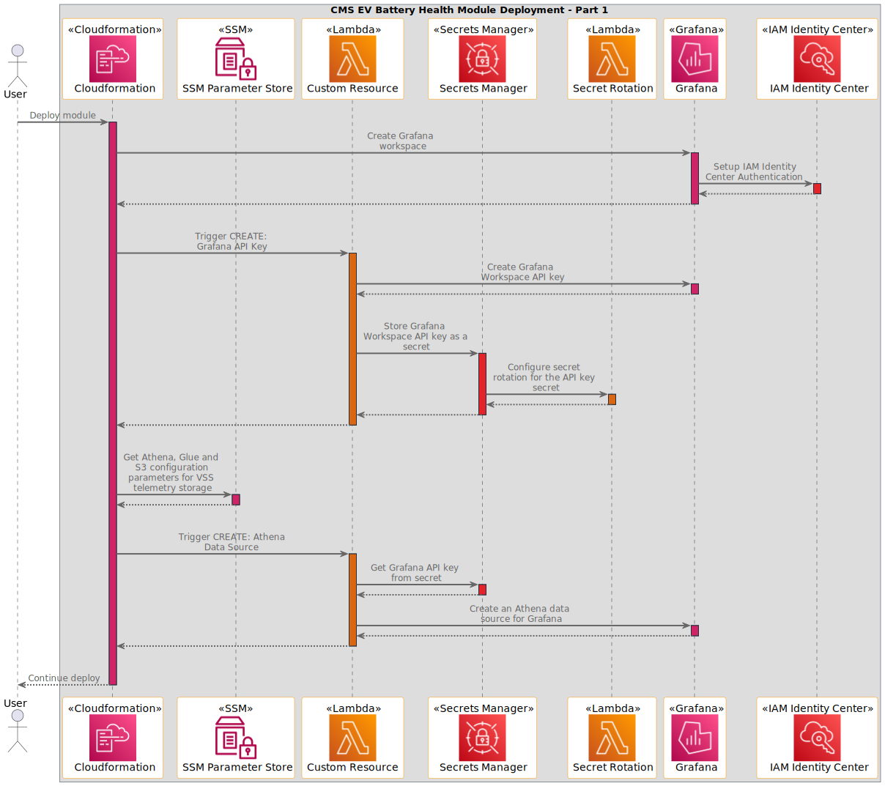
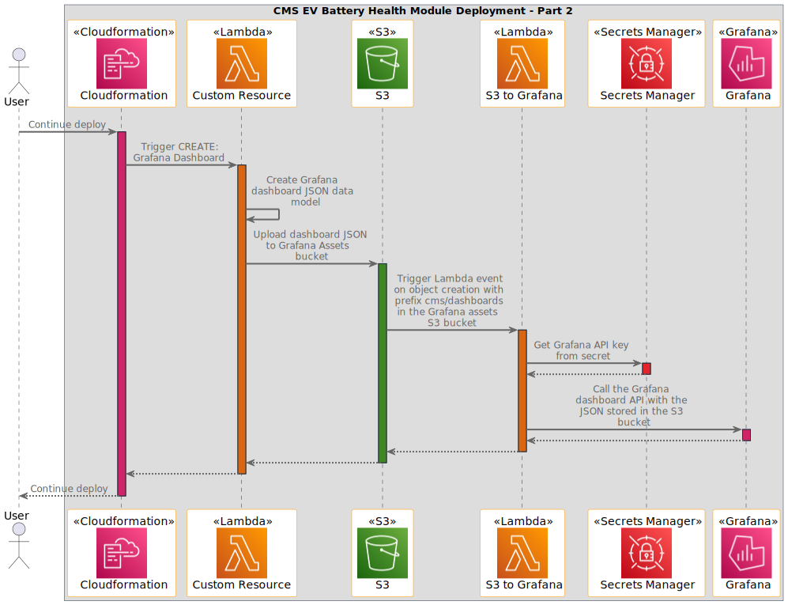
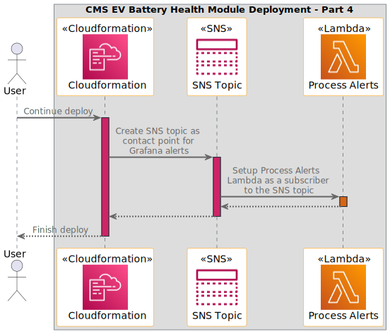
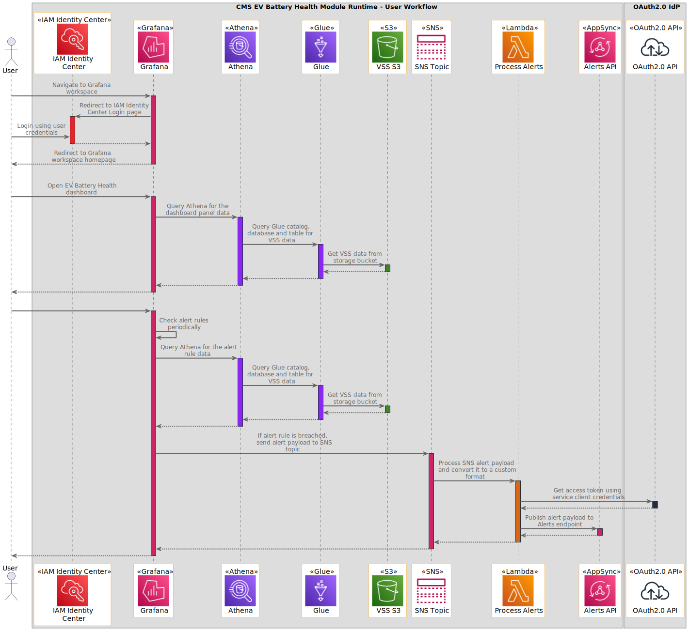
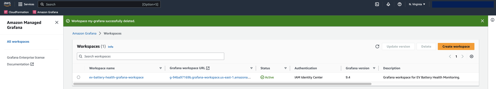
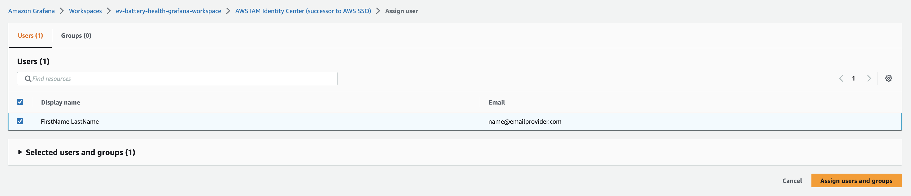
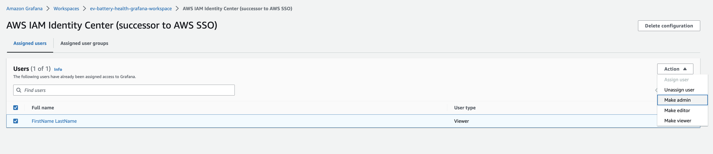
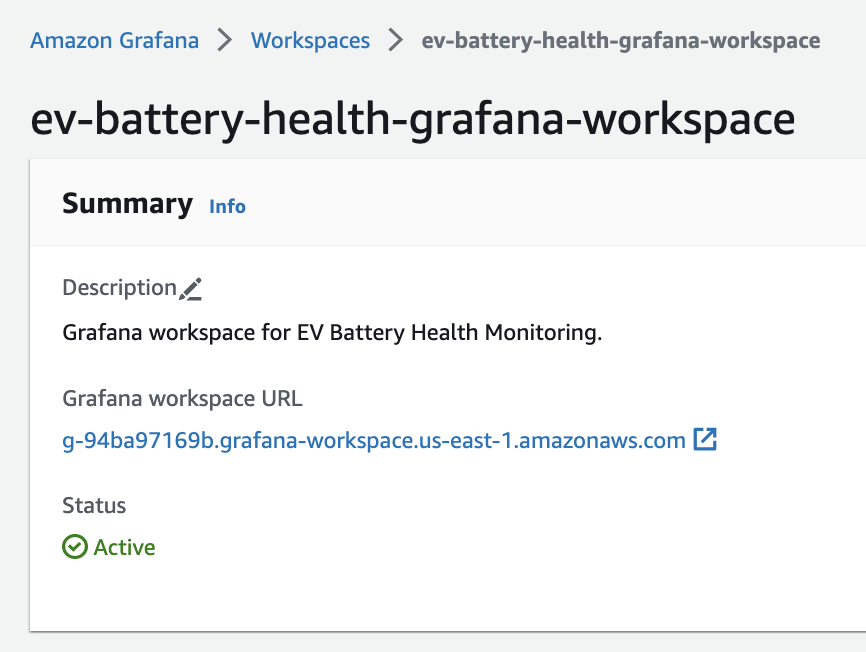

# Connected Mobility Solution on AWS - EV Battery Health Module
<!-- markdownlint-disable-next-line -->
**[Connected Mobility Solution on AWS](https://aws.amazon.com/solutions/implementations/connected-mobility-solution-on-aws/)** | **[🚧 Feature request](https://github.com/aws-solutions/connected-mobility-solution-on-aws/issues/new?assignees=&labels=enhancement&template=feature_request.md&title=)** | **[🐛 Bug Report](https://github.com/aws-solutions/connected-mobility-solution-on-aws/issues/new?assignees=&labels=bug&template=bug_report.md&title=)** | **[❓ General Question](https://github.com/aws-solutions/connected-mobility-solution-on-aws/issues/new?assignees=&labels=question&template=general_question.md&title=)**

**Note**: If you want to use the solution without building from source, navigate to the [AWS Solution Page](https://aws.amazon.com/solutions/implementations/connected-mobility-solution-on-aws/).

## Table of Contents

- [Connected Mobility Solution on AWS - EV Battery Health Module](#connected-mobility-solution-on-aws---ev-battery-health-module)
  - [Table of Contents](#table-of-contents)
  - [Solution Overview](#solution-overview)
  - [Architecture Diagram](#architecture-diagram)
  - [Sequence Diagram](#sequence-diagram)
    - [Deployment](#deployment)
    - [Runtime](#runtime)
  - [AWS CDK and Solutions Constructs](#aws-cdk-and-solutions-constructs)
  - [Prerequisites](#prerequisites)
    - [MacOS Installation Instructions](#macos-installation-instructions)
    - [Clone the Repository](#clone-the-repository)
    - [Install required Dependencies](#install-required-dependencies)
    - [Unit Test](#unit-test)
    - [Build the Module](#build-the-module)
    - [Upload Assets to S3](#upload-assets-to-s3)
    - [Deploy on AWS](#deploy-on-aws)
    - [Delete](#delete)
    - [Post-deploy Instructions](#post-deploy-instructions)
      - [AWS IAM Identity Center (successor to AWS SSO)](#aws-iam-identity-center-successor-to-aws-sso)
      - [Amazon Managed Grafana](#amazon-managed-grafana)
      - [Grafana workspace](#grafana-workspace)
  - [Customizing the Solution](#customizing-the-solution)
  - [Securing the Solution](#securing-the-solution)
    - [Network Access Control](#network-access-control)
  - [Cost Scaling](#cost-scaling)
  - [Collection of Operational Metrics](#collection-of-operational-metrics)
  - [License](#license)

## Solution Overview

Connected Mobility Solution on AWS (CMS) provides a connected vehicle platform with various capabilities
for automotive industry customers to leverage. With widespread electrification of vehicles across the
automotive industry, battery health monitoring and alerting becomes increasingly crucial for automotive
manufacturers, fleet managers and individual vehicle owners alike. With the increasing pace of development
of novel battery technologies, developing new methods and standards for continuously monitoring the battery
health is important. CMS EV Battery Health module provides battery health monitoring and alerting capability
by means of configurable dashboards and alerts based on vehicle telemetry data.

For more information and a detailed deployment guide, visit the
[CMS EV Battery health](https://docs.aws.amazon.com/solutions/latest/connected-mobility-solution-on-aws/ev-battery-health-module.html)
Implementation Guide page.

## Architecture Diagram


## Sequence Diagram

### Deployment






### Runtime




## AWS CDK and Solutions Constructs

[AWS Cloud Development Kit (AWS CDK)](https://aws.amazon.com/cdk/) and
[AWS Solutions Constructs](https://aws.amazon.com/solutions/constructs/) make it easier to consistently create
well-architected infrastructure applications. All AWS Solutions Constructs are reviewed by AWS and use best
practices established by the AWS Well-Architected Framework.

In addition to the AWS Solutions Constructs, the solution uses AWS CDK directly to create infrastructure resources.

## Prerequisites

- [Python 3.8+](https://www.python.org/downloads/)
- [NVM](https://github.com/nvm-sh/nvm)
- [NPM 8+](https://docs.npmjs.com/downloading-and-installing-node-js-and-npm)
- [Node 18+](https://docs.npmjs.com/downloading-and-installing-node-js-and-npm)
- [Pipenv](https://pipenv.pypa.io/en/latest/installation.html)

### MacOS Installation Instructions

Pyenv [Github Repository](https://github.com/pyenv/pyenv)

```bash
brew install pyenv
pyenv install 3.10.9
```

Pipenv [Github Repository](https://github.com/pypa/pipenv)

```bash
pip install --user pipenv
pipenv install --dev
```

NVM [Github Repository](https://github.com/nvm-sh/nvm)

```bash
curl -o- https://raw.githubusercontent.com/nvm-sh/nvm/v0.39.3/install.sh | bash
```

NPM/Node [Official Documentation](https://docs.npmjs.com/downloading-and-installing-node-js-and-npm)

```bash
nvm install 18
nvm use 18
```

### Clone the Repository

```bash
git clone https://github.com/aws-solutions/connected-mobility-solution-on-aws.git
cd connected-mobility-solution-on-aws/source/modules/cms_ev_battery_health/
```

### Install required Dependencies

```bash
make install
```

### Unit Test

After making changes, run unit tests to make sure added customization
passes the tests:

```bash
make test
```

### Build the Module

The build script manages dependencies, builds required assets (e.g. packaged lambdas), and creates the
AWS Cloudformation templates.

```bash
make build
```

### Upload Assets to S3

```bash
make upload
```

### Deploy on AWS

```bash
make deploy
```

### Delete

```bash
make destroy
```

### Post-deploy Instructions

Once the solution is deployed, follow the steps detailed below to access the Grafana workspace which contains
the EV battery health dashboard and alert rules.

#### AWS IAM Identity Center (successor to AWS SSO)

Follow the instructions for Step 1 and Step 2 in the AWS IAM Identity Center
[documentation](https://docs.aws.amazon.com/singlesignon/latest/userguide/getting-started.html) to create users.

#### Amazon Managed Grafana

1. Navigate to Amazon Managed Grafana from the AWS console
   
2. Click on the newly created workspace named `ev-battery-health-grafana-workspace-<STAGE>`
3. In the authentication tab within the Grafana workspace console, click the `Assign new user or group`
button under the `AWS IAM Identity Center (successor to AWS SSO)` section
   
4. Assign the users created in `AWS IAM Identity Center` to the Grafana workspace
   
5. Set the appropriate role for the assigned user. Click the checkbox next to the user and on the top right
corner click the `Actions` dropdown and choose the role to assign to the user
   
6. In the Grafana workspace page in the console, click on the workspace URL and sign in using the `AWS IAM Identity Center`
credentials to access the Grafana workspace
   

#### Grafana workspace

1. To access the dashboard, navigate to `Home -> Dashboards -> General -> EV Battery Health Dashboard` in the Grafana workspace
2. To access the alert rules, navigate to `Home -> Alerting -> Alert rules` in the Grafana workspace

## Customizing the Solution

1. Customizing the dashboard: add/remove panels in the `create_ev_battery_health_dashboard`
function [here](./source/handlers/custom_resource/lib/dashboards.py)
2. Customizing the alerts: add/remove alert rules in the `create_ev_battery_health_alert_rule_group`
function [here](./source/handlers/custom_resource/lib/alerts.py)

## Securing the Solution

### Network Access Control

To configure network access control for the Grafana workspace, follow the documentation provided
[here](https://docs.aws.amazon.com/grafana/latest/userguide/AMG-configure-nac.html).

## Cost Scaling

Cost will scale based on usage of Amazon Managed Grafana and AWS Lambda invocations.

- [Amazon Managed Grafana Cost](https://aws.amazon.com/grafana/pricing/).
- [AWS Lambda Cost](https://aws.amazon.com/lambda/pricing/)

For more details, see the
[implementation guide](https://docs.aws.amazon.com/solutions/latest/connected-mobility-solution-on-aws/cost.html).

## Collection of Operational Metrics

This solution collects anonymized operational metrics to help AWS improve
the quality and features of the solution. For more information, including
how to disable this capability, please see the
[implementation guide](https://docs.aws.amazon.com/solutions/latest/connected-mobility-solution-on-aws/anonymized-data-collection.html).

## License

Copyright Amazon.com, Inc. or its affiliates. All Rights Reserved.

Licensed under the Apache License, Version 2.0 (the "License").
You may not use this file except in compliance with the License.
You may obtain a copy of the License at <http://www.apache.org/licenses/LICENSE-2.0>

Unless required by applicable law or agreed to in writing, software
distributed under the License is distributed on an "AS IS" BASIS,
WITHOUT WARRANTIES OR CONDITIONS OF ANY KIND, either express or implied.
See the License for the specific language governing permissions and
limitations under the License.
