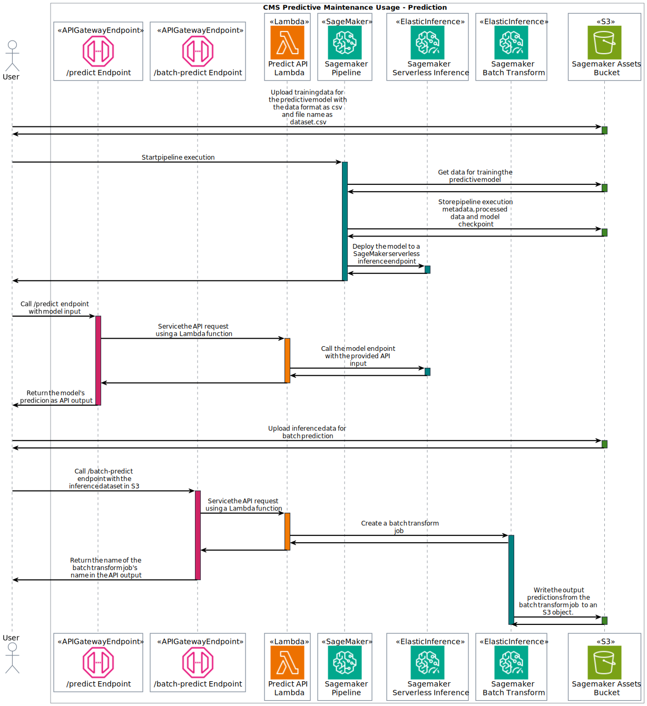
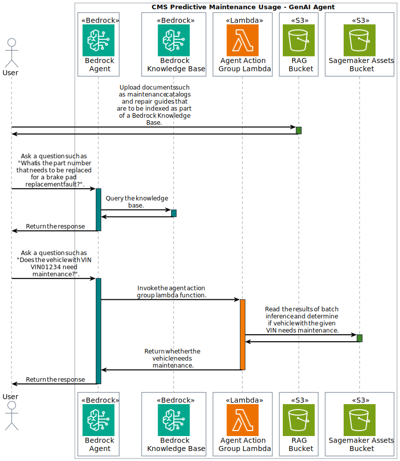

# Connected Mobility Solution on AWS - Predictive Maintenance Module
<!-- markdownlint-disable-next-line -->
**[Connected Mobility Solution on AWS](https://aws.amazon.com/solutions/implementations/connected-mobility-solution-on-aws/)** | **[🚧 Feature request](https://github.com/aws-solutions/connected-mobility-solution-on-aws/issues/new?assignees=&labels=enhancement&template=feature_request.md&title=)** | **[🐛 Bug Report](https://github.com/aws-solutions/connected-mobility-solution-on-aws/issues/new?assignees=&labels=bug&template=bug_report.md&title=)** | **[❓ General Question](https://github.com/aws-solutions/connected-mobility-solution-on-aws/issues/new?assignees=&labels=question&template=general_question.md&title=)**

**Note**: If you want to use the solution without building from source, navigate to the [AWS Solution Page](https://aws.amazon.com/solutions/implementations/connected-mobility-solution-on-aws/).

- [Connected Mobility Solution on AWS - Predictive Maintenance Module](#connected-mobility-solution-on-aws---predictive-maintenance-module)
  - [Solution Overview](#solution-overview)
  - [Architecture Diagram](#architecture-diagram)
    - [Machine Learning Pipeline](#machine-learning-pipeline)
    - [Generative AI Agent](#generative-ai-agent)
  - [Sequence Diagram](#sequence-diagram)
    - [Machine Learning Pipeline](#machine-learning-pipeline-1)
    - [Generative AI Agent](#generative-ai-agent-1)
  - [AWS CDK and Solutions Constructs](#aws-cdk-and-solutions-constructs)
  - [Customizing the Module](#customizing-the-module)
  - [Prerequisites](#prerequisites)
    - [MacOS Installation Instructions](#macos-installation-instructions)
    - [Manual Steps](#manual-steps)
      - [Foundation Model Access Permissions](#foundation-model-access-permissions)
    - [Clone the Repository](#clone-the-repository)
    - [Install Required Dependencies](#install-required-dependencies)
    - [Unit Test](#unit-test)
    - [Build the Module](#build-the-module)
    - [Upload Assets to S3](#upload-assets-to-s3)
    - [Deploy on AWS](#deploy-on-aws)
    - [Delete](#delete)
  - [Usage](#usage)
    - [Run Amazon SageMaker Pipeline](#run-amazon-sagemaker-pipeline)
    - [Amazon Bedrock Agent](#amazon-bedrock-agent)
    - [APIs](#apis)
  - [Cost Scaling](#cost-scaling)
  - [Collection of Operational Metrics](#collection-of-operational-metrics)
  - [License](#license)

## Solution Overview

CMS Predictive Maintenance is a practical example for implementing a new module within CMS on AWS. This module contains
the necessary files for configuring a CMS on AWS module to be deployed via CMS Backstage. Compare the CMS
Predictive Maintenance module file structure and files against existing CMS on AWS modules for a better idea of how to
customize the CMS Predictive Maintenance module for your own usage.

For more information and a detailed deployment guide, visit the
[Connected Mobility Solution on AWS](https://aws.amazon.com/solutions/implementations/connected-mobility-solution-on-aws/)
solution page.

## Architecture Diagram

### Machine Learning Pipeline


### Generative AI Agent


## Sequence Diagram

### Machine Learning Pipeline



### Generative AI Agent



## AWS CDK and Solutions Constructs

[AWS Cloud Development Kit (AWS CDK)](https://aws.amazon.com/cdk/) and
[AWS Solutions Constructs](https://aws.amazon.com/solutions/constructs/) make it easier to consistently create
well-architected infrastructure applications. All AWS Solutions Constructs are reviewed by AWS and use best
practices established by the AWS Well-Architected Framework.

In addition to the AWS Solutions Constructs, the solution uses AWS CDK directly to create infrastructure resources.

## Customizing the Module

## Prerequisites

- [Python 3.12+](https://www.python.org/downloads/)
- [NVM](https://github.com/nvm-sh/nvm)
- [NPM 8+](https://docs.npmjs.com/downloading-and-installing-node-js-and-npm)
- [Node 18+](https://docs.npmjs.com/downloading-and-installing-node-js-and-npm)
- [Pipenv](https://pipenv.pypa.io/en/latest/installation.html)

### MacOS Installation Instructions

Pyenv [Github Repository](https://github.com/pyenv/pyenv)

```bash
brew install pyenv
pyenv install 3.12
```

Pipenv [Github Repository](https://github.com/pypa/pipenv)

```bash
pip install --user pipenv
pipenv sync --dev
```

NVM [Github Repository](https://github.com/nvm-sh/nvm)

```bash
curl -o- https://raw.githubusercontent.com/nvm-sh/nvm/v0.39.3/install.sh | bash
```

NPM/Node [Official Documentation](https://docs.npmjs.com/downloading-and-installing-node-js-and-npm)

```bash
nvm install 18
nvm use 18
```

### Manual Steps

#### Foundation Model Access Permissions

- Access to Amazon Bedrock foundation models isn't granted by default. Follow the [Bedrock Official Documentation](https://docs.aws.amazon.com/bedrock/latest/userguide/model-access.html)
  to gain access to all the foundation Models.

### Clone the Repository

```bash
git clone https://github.com/aws-solutions/connected-mobility-solution-on-aws.git
cd connected-mobility-solution-on-aws/source/modules/cms_predictive_maintenance/
```

### Install Required Dependencies

```bash
make install
```

### Unit Test

After making changes, run unit tests to make sure added customization
pass the tests:

```bash
make test
```

### Build the Module

The build script manages dependencies, builds required assets (e.g. packaged lambdas), and creates the
AWS Cloudformation templates.

```bash
make build
```

### Upload Assets to S3

```bash
make upload
```

### Deploy on AWS

```bash
make deploy
```

### Delete

```bash
make destroy
```

## Usage

### Run Amazon SageMaker Pipeline

- Upload the dataset that you want to train a predictive model to the S3 bucket with
  the name stored in the SSM Parameter named `/solution/cms/predictive-maintenance/predictor/pipeline/assets-bucket/name`.
  The dataset should be named `dataset.csv` and can be present in any subfolder within
  the S3 bucket. All the columns of the CSV file except the last column are treated
  as inputs to the model and the last column values are treated as the output labels.
- Open the SageMaker [console](https://us-west-2.console.aws.amazon.com/sagemaker/)
- In the `Applications and IDEs` section, open the `Studio` subsection
- Select the `cms-predictive-maintenance-admin` user profile and click `Open Studio`
- In the SageMaker Studio console, open `Pipelines` and open the `cms-predictive-maintenance-pipeline`
- Click the `Execute` button and fill in the input parameters
- For the `RawDatasetS3Uri`, input the S3 URI of the dataset
- Click `Execute` to run the pipeline

### Amazon Bedrock Agent

Use the following scripts to test the chatbot functionality.

```bash
# Test RAG using the created Bedrock Knowledge Base
pipenv run python3 test_scripts/chatbot_query_knowledge_base.py --query "<insert query here>"

# Test orchestration using the created Bedrock Agent
pipenv run python3 test_scripts/chatbot_query_agent.py --query "<insert query here>"
```

### APIs

<!-- markdownlint-disable MD013 -->
| API Path | HTTP Method | Description |
| :---------------- | :------- | :---- |
| /predict | POST | Provide an input to the trained SageMaker model and receive a prediction output |
| /batch-predict | POST | Upload a batch dataset as a CSV file to the S3 bucket whose name is stored in the SSM parameter named `/solution/cms/predictive-maintenance/predictor/pipeline/assets-bucket/name` and its object key being `inference/latest.csv`. This API will kick off a SageMaker BatchTransform job and store the results in the same S3 bucket with object key as `inference/latest.csv.out` |
<!-- markdownlint-enable MD013 -->

A postman [collection](./documentation/postman/cms-predictive-maintenance-predict-api.postman_collection.json)
is provided to test these API calls and provides the required API schema.

## Cost Scaling

There is no cost the CMS Predictive Maintenance module.

For more details, see the
[implementation guide](https://docs.aws.amazon.com/solutions/latest/connected-mobility-solution-on-aws/cost.html).

## Collection of Operational Metrics

This solution collects anonymized operational metrics to help AWS improve
the quality and features of the solution. For more information, including
how to disable this capability, please see the
[implementation guide](https://docs.aws.amazon.com/solutions/latest/connected-mobility-solution-on-aws/anonymized-data-collection.html).

## License

Copyright Amazon.com, Inc. or its affiliates. All Rights Reserved.

Licensed under the Apache License, Version 2.0 (the "License").
You may not use this file except in compliance with the License.
You may obtain a copy of the License at <http://www.apache.org/licenses/LICENSE-2.0>

Unless required by applicable law or agreed to in writing, software
distributed under the License is distributed on an "AS IS" BASIS,
WITHOUT WARRANTIES OR CONDITIONS OF ANY KIND, either express or implied.
See the License for the specific language governing permissions and
limitations under the License.
