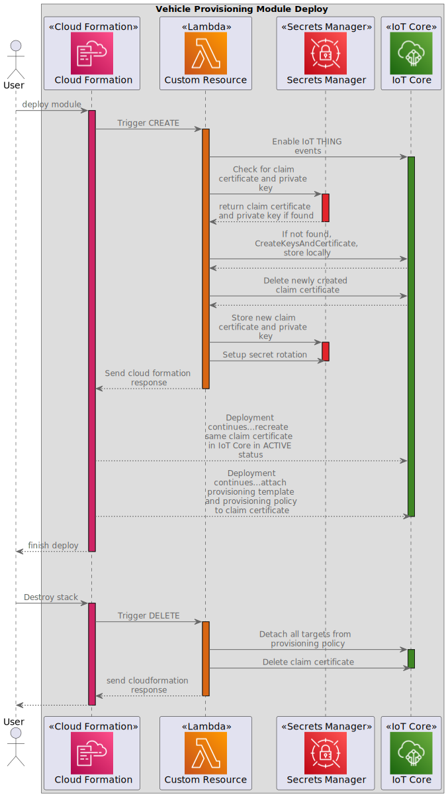

# Connected Mobility Solution on AWS - Provisioning Module
<!-- markdownlint-disable-next-line -->
**[Connected Mobility Solution on AWS](https://aws.amazon.com/solutions/implementations/connected-mobility-solution-on-aws/)** | **[🚧 Feature request](https://github.com/aws-solutions/connected-mobility-solution-on-aws/issues/new?assignees=&labels=enhancement&template=feature_request.md&title=)** | **[🐛 Bug Report](https://github.com/aws-solutions/connected-mobility-solution-on-aws/issues/new?assignees=&labels=bug&template=bug_report.md&title=)** | **[❓ General Question](https://github.com/aws-solutions/connected-mobility-solution-on-aws/issues/new?assignees=&labels=question&template=general_question.md&title=)**

**Note**: If you want to use the solution without building from source, navigate to the [AWS Solution Page](https://aws.amazon.com/solutions/implementations/connected-mobility-solution-on-aws/).

## Table of Contents

- [Connected Mobility Solution on AWS - Provisioning Module](#connected-mobility-solution-on-aws---provisioning-module)
  - [Table of Contents](#table-of-contents)
  - [Solution Overview](#solution-overview)
  - [Architecture Diagram](#architecture-diagram)
  - [Sequence Diagrams](#sequence-diagrams)
  - [AWS CDK and Solutions Constructs](#aws-cdk-and-solutions-constructs)
  - [Customizing the Module](#customizing-the-module)
  - [Prerequisites](#prerequisites)
    - [MacOS Installation Instructions](#macos-installation-instructions)
    - [Clone the Repository](#clone-the-repository)
    - [Install Required Dependencies](#install-required-dependencies)
    - [Unit Test](#unit-test)
    - [Local Testing](#local-testing)
    - [Build the Module](#build-the-module)
    - [Upload Assets to S3](#upload-assets-to-s3)
    - [Deploy on AWS](#deploy-on-aws)
    - [Delete](#delete)
  - [Usage](#usage)
  - [Cost Scaling](#cost-scaling)
  - [Collection of Operational Metrics](#collection-of-operational-metrics)
  - [License](#license)

## Solution Overview

CMS Vehicle Provisioning is a deployable module within [Connected Mobility Solution on AWS](/README.md)
(CMS) that enables vehicles to connect to IoT core using TLS-based mutual authentication. Vehicles
must be provisioned with Amazon Trust Services Root Certificate Authority (CA). A customer may also elect to
use their own private CA. The provisioning process encompasses generating a unique public/private key pair, and
assembling and signing an X.509 certificate. Ideally, the vehicle should have a pre-programmed or generatable
private/public key pair in order for the private key to be stored on their secure storage (TPM/HS, Secure enclave, etc.).
Best security practice recommends that private keys shall never be transmitted over any communication channels. However,
this is not always possible. In this case, the vehicle must be registered using the fleet provisioning process before it
can access CMS provided services.

For more information and a detailed deployment guide, visit the
[CMS Vehicle Provisioning](https://docs.aws.amazon.com/solutions/latest/connected-mobility-solution-on-aws/vehicle-provisioning-module.html)
Implementation Guide page.

## Architecture Diagram


## Sequence Diagrams




## AWS CDK and Solutions Constructs

[AWS Cloud Development Kit (AWS CDK)](https://aws.amazon.com/cdk/) and
[AWS Solutions Constructs](https://aws.amazon.com/solutions/constructs/) make it easier to consistently create
well-architected infrastructure applications. All AWS Solutions Constructs are reviewed by AWS and use best
practices established by the AWS Well-Architected Framework.

In addition to the AWS Solutions Constructs, the solution uses AWS CDK directly to create infrastructure resources.

## Customizing the Module

## Prerequisites

- [Python 3.12+](https://www.python.org/downloads/)
- [NVM](https://github.com/nvm-sh/nvm)
- [NPM 8+](https://docs.npmjs.com/downloading-and-installing-node-js-and-npm)
- [Node 18+](https://docs.npmjs.com/downloading-and-installing-node-js-and-npm)
- [Pipenv](https://pipenv.pypa.io/en/latest/installation.html)

### MacOS Installation Instructions

Pyenv [Github Repository](https://github.com/pyenv/pyenv)

```bash
brew install pyenv
pyenv install 3.12
```

Pipenv [Github Repository](https://github.com/pypa/pipenv)

```bash
pip install --user pipenv
pipenv install --dev
```

NVM [Github Repository](https://github.com/nvm-sh/nvm)

```bash
curl -o- https://raw.githubusercontent.com/nvm-sh/nvm/v0.39.3/install.sh | bash
```

NPM/Node [Official Documentation](https://docs.npmjs.com/downloading-and-installing-node-js-and-npm)

```bash
nvm install 18
nvm use 18
```

### Clone the Repository

```bash
git clone https://github.com/aws-solutions/connected-mobility-solution-on-aws.git
cd connected-mobility-solution-on-aws/source/modules/cms_provisioning/
```

### Install Required Dependencies

```bash
make install
```

### Unit Test

After making changes, run unit tests to make sure added customization
pass the tests:

```bash
make test
```

### Local Testing

For manual local testing, a test script is provided in the `test_scripts` directory:

- provisioning_by_claim.py
  - Fetches a claim certificate and corresponding private key from Amazon CA. Then generates new
  credentials (private key and certificate) and uses those credentials to execute the vehicle provisioning flow. After execution,
  the vehicle and certificate will be registered in IoT Core and stored in DynamoDB. After provisioning, it posts a message
  to the `vehicleactive` MQTT topic, triggering the initial detection flag for a vehicle connecting for the first time.

This script relies on these AWS account credentials:

- .aws/config
- .aws/credentials

Run these scripts from outside the test_scripts folder:

```bash
python -m test_scripts.provisioning_by_claim
```

### Build the Module

The build script manages dependencies, builds required assets (e.g. packaged lambdas), and creates the
AWS Cloudformation templates.

```bash
make build
```

### Upload Assets to S3

```bash
make upload
```

### Deploy on AWS

```bash
make deploy
```

### Delete

```bash
make destroy
```

## Usage

Each vehicle connecting to IoT Core for use with CMS on AWS must be provisioned as a valid ‘thing’ within IoT Core:

- A vehicle must have its unique X.509 Certificate
- A valid IoT policy must be attached to said Certificate
- A vehicle must be registered in IoT device registry

The device public key infrastructure (PKI) consists of Certificate Authorities (CAs) that issue and sign X.509 device
certificates to establish a source of trust for a device. A customer may elect between:

- IoT Core generated certificates using AWS CA.
  - Option 1: A private key is also generate by AWS. Once generated, the private key and device
  certificate must be securely downloaded and copied to a vehicle.
  - Option 2: A vehicle already has a private key, so a certificate signing request (CSR) is sent to AWS IoT core.
- Private CA. This is more suitable for larger enterprise customers.
- Third-party CA

## Cost Scaling

Cost will be dependent on the numbers of vehicles provisioned and data stored.

- [AWS IoT Core Cost](https://aws.amazon.com/iot-core/pricing/)
- [Amazon DynamoDB Cost](https://aws.amazon.com/dynamodb/pricing/)

For more details, see the
[implementation guide](https://docs.aws.amazon.com/solutions/latest/connected-mobility-solution-on-aws/cost.html).

## Collection of Operational Metrics

This solution collects anonymized operational metrics to help AWS improve
the quality and features of the solution. For more information, including
how to disable this capability, please see the
[implementation guide](https://docs.aws.amazon.com/solutions/latest/connected-mobility-solution-on-aws/anonymized-data-collection.html).

## License

Copyright Amazon.com, Inc. or its affiliates. All Rights Reserved.

Licensed under the Apache License, Version 2.0 (the "License").
You may not use this file except in compliance with the License.
You may obtain a copy of the License at <http://www.apache.org/licenses/LICENSE-2.0>

Unless required by applicable law or agreed to in writing, software
distributed under the License is distributed on an "AS IS" BASIS,
WITHOUT WARRANTIES OR CONDITIONS OF ANY KIND, either express or implied.
See the License for the specific language governing permissions and
limitations under the License.
