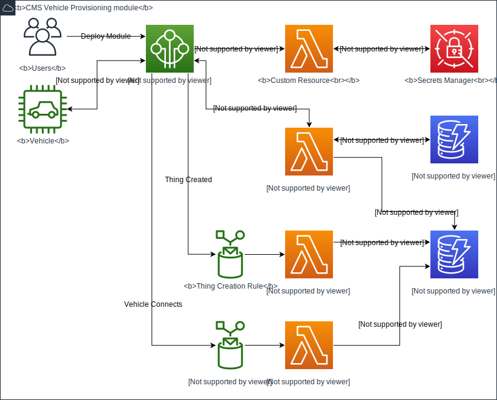
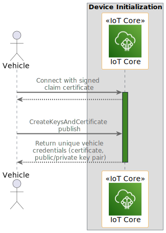
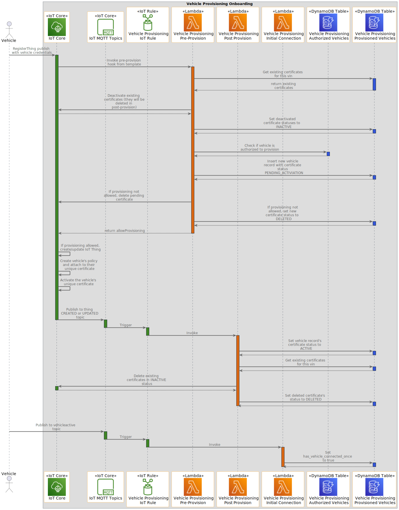

# Connected Mobility Solution on AWS - Provisioning Module

**[Connected Mobility Solution on AWS](https://aws.amazon.com/solutions/implementations/connected-mobility-solution-on-aws/)** | **[🚧 Feature request](https://github.com/aws-solutions/connected-mobility-solution-on-aws/issues/new?assignees=&labels=enhancement&template=feature_request.md&title=)** | **[🐛 Bug Report](https://github.com/aws-solutions/connected-mobility-solution-on-aws/issues/new?assignees=&labels=bug&template=bug_report.md&title=)** | **[❓ General Question](https://github.com/aws-solutions/connected-mobility-solution-on-aws/issues/new?assignees=&labels=question&template=general_question.md&title=)**

**Note**: If you want to use the solution without building from source, navigate to the [AWS Solution Page](https://dummy.com).

## Table of Contents
- [Connected Mobility Solution on AWS - Provisioning Module](#connected-mobility-solution-on-aws---provisioning-module)
  - [Table of Contents](#table-of-contents)
  - [Solution Overview](#solution-overview)
  - [Architecture Diagram](#architecture-diagram)
  - [Sequence Diagram](#sequence-diagram)
  - [AWS CDK and Solutions Constructs](#aws-cdk-and-solutions-constructs)
  - [Customizing the Module](#customizing-the-module)
  - [Prerequisites](#prerequisites)
      - [Optional but Helpful](#optional-but-helpful)
      - [MacOS Installation Instructions](#macos-installation-instructions)
    - [Clone the Repository](#clone-the-repository)
    - [Unit Test](#unit-test)
    - [Local Testing](#local-testing)
    - [Build](#build)
      - [Build Using Script](#build-using-script)
      - [Manually Build](#manually-build)
    - [Deploy](#deploy)
  - [Cost Scaling](#cost-scaling)
  - [Collection of Operational Metrics](#collection-of-operational-metrics)
  - [License](#license)

## Solution Overview

The vehicles are connecting to IoT core using TLS-based mutual authentication must be provisioned with Amazon Trust Services
Root Certificate Authority (CA). In some cases, though, a customer may elect to use their own private CA. The provisioning
process implies generating a unique public/private key pair, assembling, and signing an X.509 certificate. Ideally, the vehicle
should have a pre-programmed, or generatable, private/public key pair in order for the private key to be stored on their secure
storage (TPM/HSM/Secure enclave/etc.). Best security practice recommends that private keys shall never be transmitted over
any communication channels. However, this is not always possible for various reasons. In this case, the vehicle must be
registered using the fleet provisioning process before it can access CMS provided services.

Each vehicle connecting to IoT Core for the CMS solution must be provisioned and recognized as a valid ‘thing’ within IoT Core:
- A vehicle must have its unique X.509 Certificate
- A vehicle must be registered in IoT device registry
- An IoT policy, which could be shared among the vehicles, must be attached to the Certificate.

The device public key infrastructure (PKI) consists of Certificate Authorities (CAs) that issue and sign X.509 device certificates to
establish a source of trust for a device. A customer may elect between:
- IoT Core generated certificates using AWS CA.
  - Option 1: a private key is also being generated on the AWS side; once generated, the private key and device
certificate must be securely downloaded and copied to a vehicle.
  - Option 2: a vehicle already has a private key, so a certificate signing request (CSR) is sent to AWS IoT core.
- Private Certificate Authority (CA). This is more suitable for larger enterprise customers.
- Third-party CA

For more information and a detailed deployment guide, visit the
[CMS Provisioning](https://aws.amazon.com/solutions/implementations/cms-provisioning/) solution page.

## Architecture Diagram


## Sequence Diagram




## AWS CDK and Solutions Constructs

[AWS Cloud Development Kit (AWS CDK)](https://aws.amazon.com/cdk/) and
[AWS Solutions Constructs](https://aws.amazon.com/solutions/constructs/) make it easier to consistently create
well-architected infrastructure applications. All AWS Solutions Constructs are reviewed by AWS and use best
practices established by the AWS Well-Architected Framework.

In addition to the AWS Solutions Constructs, the solution uses AWS CDK directly to create infrastructure resources.

## Customizing the Module

## Prerequisites

- [Python 3.8+](https://www.python.org/downloads/)
- [NVM](https://github.com/nvm-sh/nvm)
- [NPM 8+](https://docs.npmjs.com/downloading-and-installing-node-js-and-npm)
- [Node 18+](https://docs.npmjs.com/downloading-and-installing-node-js-and-npm)
- [Pipenv](https://pipenv.pypa.io/en/latest/installation/)

#### Optional but Helpful

- Pyenv [Github Repository](https://github.com/pyenv/pyenv)

#### MacOS Installation Instructions

```bash
brew install pyenv
pyenv install 3.10.9
```

Pipenv [Github Repository](https://github.com/pypa/pipenv)

```bash
pip install --user pipenv
pipenv install --dev
```

NVM [Github Repository](https://github.com/nvm-sh/nvm)

```bash
curl -o- https://raw.githubusercontent.com/nvm-sh/nvm/v0.39.3/install.sh | bash
```

NPM/Node [Official Documentation](https://docs.npmjs.com/downloading-and-installing-node-js-and-npm)

```bash
nvm install 18
nvm use 18
```

### Clone the Repository

```bash
git clone https://github.com/aws-solutions/connected-mobility-solution-on-aws.git
cd connected-mobility-solution-on-aws/templates/modules/cms_provisioning_on_aws
```

### Unit Test

After making changes, run unit tests to make sure added customization passes the tests:

```bash
chmod +x deployment/run-unit-tests.sh  # Should not be necessary
./deployment/run-unit-tests.sh
```

### Local Testing

The test script is provided in the `test_scripts` directory:

- provisioning_by_claim.py - this script will fetch a claim certificate and corresponding private key. Then, it will generate new
  credentials (private key and certificate) and use those credentials to execute the vehicle provisioning flow. After execution,
  the vehicle and certificate will be registered in IoT Core and be recorded in DynamoDB. After provisioning, it posts the first message
  to the `vehicleactive` topic, triggering the initial detection flag for that vehicle if it is connecting for the first time.

Set the execution attribute before the first use:

- `chmod a+x test_scripts/provisioning_by_claim.py`

Those scripts are relying on these AWS account credentials:

- .aws/config
- .aws/credentials

Run these scripts from outside the test_scripts folder to execute them properly:

- `python -m test_scripts.provisioning_by_claim`

### Build

#### Build Using Script

The build script manages dependencies, builds required assets (e.g. packaged lambdas), and creates the
AWS Cloudformation templates.

```bash
./deployment/build-s3-dist.sh $DIST_OUTPUT_BUCKET $TEMPLATE_OUTPUT_BUCKET $SOLUTION_NAME $VERSION
```

Upload AWS Cloudformation templates

```bash
aws cloudformation create-stack --stack-name cfn-demo --template-body file://cfn-demo.yaml
```

#### Manually Build

Install development packages

```bash
pipenv install --dev
```

Synthesize into Cloudformation

```bash
cdk synth
```

### Deploy

```bash
cdk deploy
```

## Cost Scaling

Basic usage should stay within the free tier.

## Collection of Operational Metrics

This solution collects anonymous operational metrics to help AWS improve the quality and features of the solution. For
more information, including how to disable this capability, please see the
[implementation guide](https://docs.aws.amazon.com/solutions/latest/cms-provisioningr/operational-metrics.html).

## License

Copyright Amazon.com, Inc. or its affiliates. All Rights Reserved.

Licensed under the Apache License, Version 2.0 (the "License").
You may not use this file except in compliance with the License.
You may obtain a copy of the License at

    http://www.apache.org/licenses/LICENSE-2.0

Unless required by applicable law or agreed to in writing, software
distributed under the License is distributed on an "AS IS" BASIS,
WITHOUT WARRANTIES OR CONDITIONS OF ANY KIND, either express or implied.
See the License for the specific language governing permissions and
limitations under the License.
