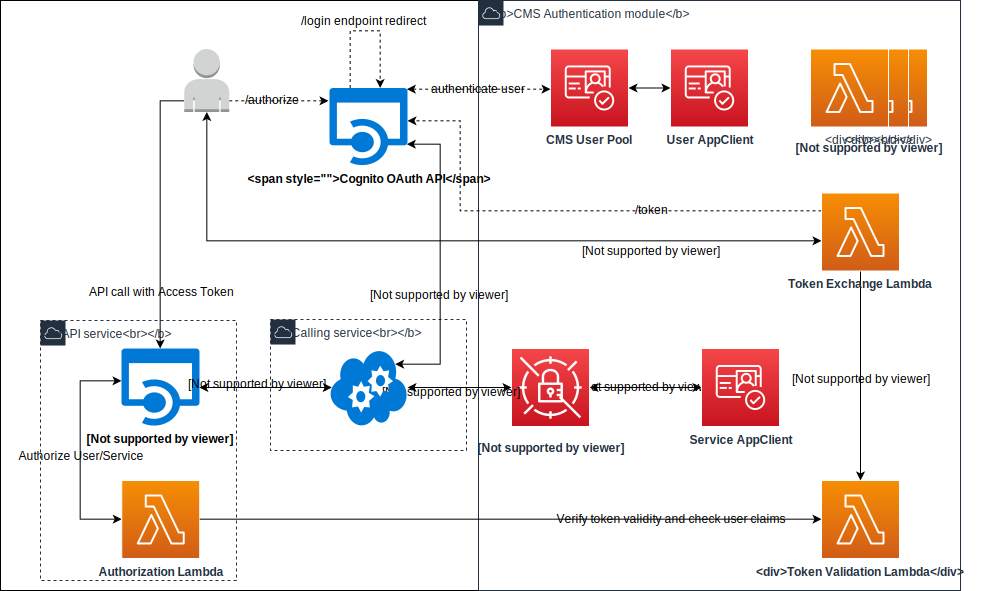

# Connected Mobility Solution on AWS - Authentication Module

**[Connected Mobility Solution on AWS](https://aws.amazon.com/solutions/implementations/connected-mobility-solution-on-aws/)** | **[🚧 Feature request](https://github.com/aws-solutions/connected-mobility-solution-on-aws/issues/new?assignees=&labels=enhancement&template=feature_request.md&title=)** | **[🐛 Bug Report](https://github.com/aws-solutions/connected-mobility-solution-on-aws/issues/new?assignees=&labels=bug&template=bug_report.md&title=)** | **[❓ General Question](https://github.com/aws-solutions/connected-mobility-solution-on-aws/issues/new?assignees=&labels=question&template=general_question.md&title=)**

**Note**: If you want to use the solution without building from source, navigate to the [AWS Solution Page](https://aws.amazon.com/solutions/implementations/connected-mobility-solution-on-aws/).

## Table of Contents
- [Connected Mobility Solution on AWS - Authentication Module](#connected-mobility-solution-on-aws---authentication-module)
  - [Table of Contents](#table-of-contents)
  - [Solution Overview](#solution-overview)
  - [Architecture Diagram](#architecture-diagram)
  - [AWS CDK and Solutions Constructs](#aws-cdk-and-solutions-constructs)
  - [Customizing the Module](#customizing-the-module)
  - [Prerequisites](#prerequisites)
      - [MacOS Installation Instructions](#macos-installation-instructions)
    - [Clone the Repository](#clone-the-repository)
    - [Unit Test](#unit-test)
    - [Build](#build)
      - [Build Using Script](#build-using-script)
      - [Manually Build](#manually-build)
    - [Deploy](#deploy)
  - [Usage](#usage)
    - [Identity Provider (Cognito)](#identity-provider-cognito)
    - [User Authentication](#user-authentication)
      - [Authorization Code](#authorization-code)
    - [Service Authentication](#service-authentication)
  - [Cost Scaling](#cost-scaling)
  - [Collection of Operational Metrics](#collection-of-operational-metrics)
  - [License](#license)

## Solution Overview
CMS Authentication on AWS is a deployable module within [Connected Mobility Solution on AWS](/README.md)
(CMS) that provides means for CMS users and internal services to authenticate and authorize themselves for
use with CMS on AWS APIs. Users can sign-up and communicate with the provided identity provider to retrieve
authorization tokens via the authorization code grant flow, while services can communicate with a separate app
client via the client-credentials grant flow.

For more information and a detailed deployment guide, visit the
[Connected Mobility Solution on AWS](https://aws.amazon.com/solutions/implementations/connected-mobility-solution-on-aws/)
solution page.

## Architecture Diagram


## AWS CDK and Solutions Constructs

[AWS Cloud Development Kit (AWS CDK)](https://aws.amazon.com/cdk/) and
[AWS Solutions Constructs](https://aws.amazon.com/solutions/constructs/) make it easier to consistently create
well-architected infrastructure applications. All AWS Solutions Constructs are reviewed by AWS and use best
practices established by the AWS Well-Architected Framework.

In addition to the AWS Solutions Constructs, the solution uses AWS CDK directly to create infrastructure resources.

## Customizing the Module

## Prerequisites

- [Python 3.8+](https://www.python.org/downloads/)
- [NVM](https://github.com/nvm-sh/nvm)
- [NPM 8+](https://docs.npmjs.com/downloading-and-installing-node-js-and-npm)
- [Node 18+](https://docs.npmjs.com/downloading-and-installing-node-js-and-npm)
- [Pipenv](https://pipenv.pypa.io/en/latest/installation.html)

#### MacOS Installation Instructions

Pyenv [Github Repository](https://github.com/pyenv/pyenv)

```bash
brew install pyenv
pyenv install 3.10.9
```

Pipenv [Github Repository](https://github.com/pypa/pipenv)

```bash
pip install --user pipenv
pipenv install --dev
```

NVM [Github Repository](https://github.com/nvm-sh/nvm)

```bash
curl -o- https://raw.githubusercontent.com/nvm-sh/nvm/v0.39.3/install.sh | bash
```

NPM/Node [Official Documentation](https://docs.npmjs.com/downloading-and-installing-node-js-and-npm)

```bash
nvm install 18
nvm use 18
```

### Clone the Repository

```bash
git clone https://github.com/aws-solutions/connected-mobility-solution-on-aws.git
cd connected-mobility-solution-on-aws
cd templates/modules/cms_user_authentication_on_aws/
```

### Unit Test

After making changes, run unit tests to make sure added customization
passes the tests:

```bash
chmod +x deployment/run-unit-tests.sh
./deployment/run-unit-tests.sh
```

### Build

#### Build Using Script

The build script manages dependencies, builds required assets (e.g. packaged lambdas), and creates the
AWS Cloudformation templates.

```bash
./deployment/build-s3-dist.sh $DIST_OUTPUT_BUCKET $TEMPLATE_OUTPUT_BUCKET $SOLUTION_NAME $VERSION
```

Upload AWS Cloudformation templates

```bash
aws cloudformation create-stack --stack-name cfn-demo --template-body file://cfn-demo.yaml
```

#### Manually Build

Install development packages

```bash
pipenv install --dev
```

Synthesize into Cloudformation

```bash
cdk synth
```

### Deploy

```bash
cdk deploy
```

## Usage

### Identity Provider (Cognito)
Deploying this module creates an Amazon Cognito user pool with no users. This user pool is
configured with both a service and user app client. To allow users to authenticate within your
solution, they must be added to the user pool. This can be done via the aws console, and requires
email verification for new users to create their credentials.

### User Authentication
The token exchange Lambda function provided by this module can be used to exchange an authorization
code, retrieved from the authorization code grant flow and OAuth /authorize and /token endpoints,
for an id and access token. The access token can then be included in requests to CMS on AWS APIs
as a Bearer token in the Authorization header, and further validated by the API via the token
validation lambda. The token exchange lambda communicates with the Amazon Cognito OAuth API to verify
the integrity of the authorization code against the associated user app client. Furthermore, a
Proof Key for Code Exchange (PKCE) code verifier is used to protect against injection attacks which
could intercept the user tokens. The code verifier must be the same used to generate the code challenge
used to retrieve the authorization code.

#### Authorization Code
To retrieve an authorization code for user authentication, following these steps:
1. Create a `GET` request to the
[/authorize endpoint](https://docs.aws.amazon.com/cognito/latest/developerguide/authorization-endpoint.html) provided by Amazon Cognito.
1. Make sure you include the correct client_id and a code_challenge in the request body.
In the request URL ensure you use the correct aws-region and domain prefix associated with the user pool.
1. Navigating to the `GET` request URL in your browser will redirect you to a login page.
2. Logging into this page will trigger a `POST` request to the
[/token endpoint](https://docs.aws.amazon.com/cognito/latest/developerguide/token-endpoint.html) provided
by Cognito, which will return an authorization code in its response.

### Service Authentication
Internal CMS on AWS services can authenticate themselves against the provided user pool service app client
by retrieving the client credentials and scope, and exchanging them for an access token via the client
credentials grant flow and OAuth /token endpoint. The access token can then be included in requests to CMS
on AWS APIs as a Bearer token in the Authorization header, and further validated by the API via the token validation lambda.

## Cost Scaling

Cost will scale depending on the amount of lambda invocations, but in general lambda invocation costs
are low. At rest, the Authentication module's cost is minimal. For details, see the
[implementation guide](https://docs.aws.amazon.com/solutions/latest/connected-mobility-solution-on-aws/operational-metrics.html).


## Collection of Operational Metrics

This solution collects anonymized operational metrics to help AWS improve
the quality and features of the solution. For more information, including
how to disable this capability, please see the
[implementation guide](https://docs.aws.amazon.com/solutions/latest/connected-mobility-solution-on-aws/operational-metrics.html).

## License

Copyright Amazon.com, Inc. or its affiliates. All Rights Reserved.

Licensed under the Apache License, Version 2.0 (the "License").
You may not use this file except in compliance with the License.
You may obtain a copy of the License at http://www.apache.org/licenses/LICENSE-2.0

Unless required by applicable law or agreed to in writing, software
distributed under the License is distributed on an "AS IS" BASIS,
WITHOUT WARRANTIES OR CONDITIONS OF ANY KIND, either express or implied.
See the License for the specific language governing permissions and
limitations under the License.
